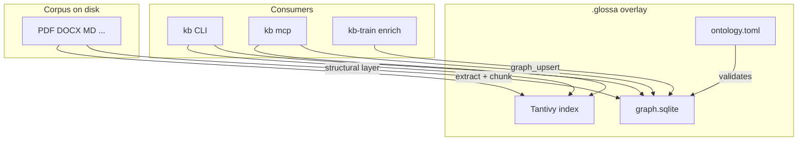

# Architecture

glossa is a **file-first** knowledge base: documents remain the source of truth; the index and graph are disposable overlays under `.glossa/`.

## Data flow

## File-first chunks

Each document is split into **chunks** with stable locations:

- Markdown / Office: heading-based sections
- PDF: one chunk per page (`p.N`)
- Plain text: streaming segments

Every chunk carries a corpus-relative path and location string. Search and `read` use `[#n]` chunk numbers; graph MENTIONS edges anchor reasoning nodes to `(path, #n)`.

Provenance on graph nodes records `source_path`, optional range, file signature, origin (`index` | `agent` | `auto-generalized`), confidence, and timestamp.

## Extraction layer

| Format | Library | Notes |
|--------|---------|-------|
| PDF | [oxidize-pdf](https://github.com/bzsanti/oxidizePdf) | Per-page text; lenient parsing; scans indexed by filename if no text |
| Office | [office_oxide](https://github.com/anthonyjoeseph/office_oxide) | doc/docx, xls/xlsx, ppt/pptx |
| Text-like | built-in | md, txt, json, yaml, xml, html, csv, source code; charset detection |

Binary files are skipped silently. Extraction is streaming (no fixed size cap).

## Index layer

Full-text search uses [Tantivy](https://github.com/quickwit-oss/tantivy) with BM25 ranking and Russian/English stemming. The index stores chunk text and metadata for ranked `search` and for `grep` (regex over extracted content).

`ensure_fresh` stat-scans the corpus before MCP reads so agents see up-to-date results without manual re-index.

## Graph layer

Storage: **SQLite** (`graph.sqlite` via rusqlite).

### Structural (layer 1, automatic)

Created during index:

- Nodes: `Document`, `Section`
- Edges: `CONTAINS`, `MENTIONS`, `NEXT`, `PREV`

No ontology validation required; always present.

### Reasoning (layer 2+, agent)

Declared in `ontology.toml` at the corpus root (`.glossa/ontology.toml`). The enricher or an MCP agent writes nodes such as `Symptom`, `Cause`, `Resolution` via `graph_upsert`. Relations (`CAUSED_BY`, `RESOLVED_BY`, …) are validated against the ontology; unknown types are rejected in strict mode.

Stable ids use configurable `id_prefix` per entity type (e.g. `sym:`, `cau:`).

### Derived (layer 3, `graph generalize`)

Non-destructive pass over stored nodes and edges:

- Transitive closure (ontology-defined composition rules)
- SIMILAR links (label Jaccard + shared evidence)
- Community detection and PageRank centrality on the reasoning subgraph
- Optional destructive passes: merge near-duplicates, prune incomplete chains (`--merge`, `--prune-incomplete` on CLI)

Implementation: [`src/graph/generalize/`](../src/graph/generalize/). Same logic runs from MCP `graph_generalize`, CLI `kb graph generalize`, and the editor maintenance loop.

Derived edges are stamped `origin = "auto-generalized"`.

## Single binary contract

[`src/graph/ops.rs`](../src/graph/ops.rs) implements `graph_upsert`, `graph_generalize`, and related operations once; MCP ([`src/mcp.rs`](../src/mcp.rs)) and the eval enricher ([`eval/src/enrich.rs`](../eval/src/enrich.rs)) call the same functions so behavior matches in production and training.

## MCP server

- **stdio** — subprocess for local IDEs
- **streamable-http** — network endpoint at `<bind>/mcp` with `/health`, `/ready`, `/metrics`

Profiles gate tools, not data freshness. See [mcp.md](mcp.md) and [deploy/mcp-server.md](deploy/mcp-server.md).

## Dependencies

glossa stands on:

| Project | Role |
|---------|------|
| [Tantivy](https://github.com/quickwit-oss/tantivy) | BM25 index |
| [oxidize-pdf](https://github.com/bzsanti/oxidizePdf) | PDF extraction |
| [office_oxide](https://github.com/anthonyjoeseph/office_oxide) | Office extraction |
| rusqlite | Graph persistence |
| rmcp | MCP protocol |

Full acknowledgments: [README.md § Acknowledgments](../README.md#acknowledgments).

## Design constraints

- Pure Rust on shipping targets; offline; single `kb` binary
- Graph is rebuildable — delete `.glossa/` and re-index
- Domain rules live in `ontology.toml`, not hardcoded in Rust (engine stays domain-agnostic)
