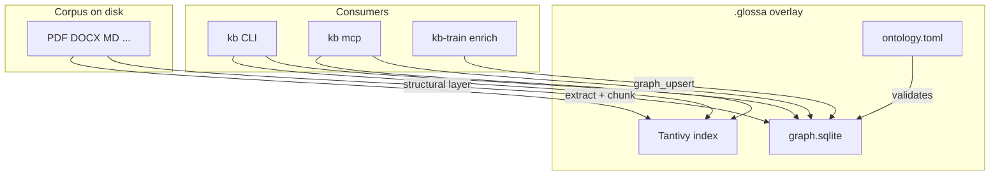

# Architecture

glossa is a **file-first** knowledge base: documents remain the source of truth; the index and graph are disposable overlays under `.glossa/`.

## Data flow

```mermaid
flowchart TB
  subgraph corpus [Corpus on disk]
    pdf[PDF DOCX MD ...]
  end
  subgraph glossa_dir [.glossa overlay]
    tantivy[Tantivy index]
    sqlite[graph.sqlite]
    ont[ontology.toml]
  end
  subgraph consumers [Consumers]
    cli[kb CLI]
    mcp[kb mcp]
    train[kb-train enrich]
  end

  pdf -->|extract + chunk| tantivy
  pdf -->|structural layer| sqlite
  train -->|graph_upsert| sqlite
  ont -->|validates| sqlite
  cli --> tantivy
  cli --> sqlite
  mcp --> tantivy
  mcp --> sqlite
```

## File-first chunks

Each document is split into **chunks** with stable locations:

- Markdown / Office: heading-based sections
- PDF: one chunk per page (`p.N`); blank pages are indexed with an empty body so every physical page `1..N` is addressable via `read(path, n)`
- Plain text: streaming segments

Every chunk carries a corpus-relative path and location string. Search and `read` use `[#n]` chunk numbers; graph MENTIONS edges anchor reasoning nodes to `(path, #n)`.

Provenance on graph nodes records `source_path`, optional range, file signature, origin (`index` | `agent` | `auto-generalized`), confidence, and timestamp.

## Extraction layer

| Format | Library | Notes |
|--------|---------|-------|
| PDF | [pdf_oxide](https://github.com/pdf-oxide/pdf-oxide) | Per-page text; blank pages indexed empty; page raster for vision agents; embedded image extraction; scans indexed by filename if no text |
| Office (OOXML + legacy) | [office_oxide](https://github.com/anthonyjoeseph/office_oxide) | doc/docx, xls/xlsx, ppt/pptx; `DocumentIR` → merge-cell densify → IR-level chunking (not whole-doc markdown) |
| OpenDocument | built-in | odt/ods/odp; `content.xml` parsed to `DocumentIR` (headings, tables with merged cells / repeats / clamps, section-per-sheet/slide), reusing the office chunker |
| Charts | built-in | OOXML (`charts/chartN.xml` cache) and ODF (embedded local `<table:table>`, or cell-range refs resolved against the sheet) → chart **data** as a searchable GFM table, one chunk per chart |
| Text-like | built-in | md, txt, json, yaml, xml, html, csv, source code; charset detection |

Embedded images reach vision-capable agents on demand via `read(page_image: true)` with `--vision`: PDF pages are rasterized; zip-based Office/ODF media (`word|xl|ppt/media/`, ODF `Pictures/`) and legacy `.doc`/`.xls` raster pictures are extracted from the container.

Binary files are skipped silently. Extraction is streaming (no fixed size cap).

### Known extraction limitations

- **Charts are extracted as data, not rendered.** glossa reads the chart's underlying series/categories/values into a text table; it does not render the chart to an image. Faithful visual rendering of an Office chart/diagram would require an external engine (LibreOffice), which glossa deliberately does not bundle (`no LibreOffice, pandoc, or separate ETL`). For a rendered-visual need, use a **PDF** source — PDF pages (including their charts) *are* rasterized for vision.
- **Legacy binary charts are not extracted.** Charts embedded in binary `.doc`/`.xls`/`.ppt` (OLE/BIFF) are skipped — office_oxide exposes no chart parser for those, and no BIFF chart parser is built in. OOXML and ODF charts are covered.
- **Legacy binary embedded images:** `.doc`/`.xls` raster pictures are extracted; `.ppt` embedded images are not (office_oxide returns none). Vector metafiles (EMF/WMF/PICT) are skipped (not rasterized).
- **ODF cell-range charts** are resolved against the sheet in the same document; cross-document/cross-sheet references, multi-column category ranges, and merged-cell regions inside a referenced range are best-effort and may under-resolve. The chart is skipped (with a log warning), never crashing extraction.

## Index layer

Full-text search uses [Tantivy](https://github.com/quickwit-oss/tantivy) with BM25 ranking and morphology-aware multilingual stemming. The index stores chunk text and metadata for ranked `search` and for `grep` (regex over extracted content).

**`grep` two-phase search:** each chunk is indexed twice for grep — `body` (stored, BM25/multilang) and `body_trigrams` (indexed-only char 3-grams with lowercase folding). For a pattern, glossa extracts a trigram boolean query from the regex (Cox-style HIR walk via `regex-syntax`), queries Tantivy for candidate chunks, then confirms line-by-line with the real `regex` engine. When no selective trigrams exist, grep scans all chunks (same results, slower). Schema bumps set `index_schema_version` in the manifest and trigger an index-only rebuild.

`ensure_fresh` stat-scans the corpus before MCP reads so agents see up-to-date results without manual re-index.

## Graph layer

Storage: **SQLite** (`graph.sqlite` via rusqlite).

### Structural (layer 1, automatic)

Created during index:

- Nodes: `Document`, `Section`
- Edges: `CONTAINS`, `MENTIONS`, `NEXT`, `PREV`

No ontology validation required; always present.

### Reasoning (layer 2+, agent)

Declared in `ontology.toml` at the corpus root (`.glossa/ontology.toml`). The enricher or an MCP agent writes nodes such as `Symptom`, `Cause`, `Resolution` via `graph_upsert`. Relations (`CAUSED_BY`, `RESOLVED_BY`, …) are validated against the ontology; unknown types are rejected in strict mode.

Stable ids use configurable `id_prefix` per entity type (e.g. `sym:`, `cau:`).

### Derived (layer 3, `graph generalize`)

Non-destructive pass over stored nodes and edges:

- Transitive closure (ontology-defined composition rules)
- SIMILAR links (label Jaccard + shared evidence)
- Community detection and PageRank centrality on the reasoning subgraph
- Optional destructive passes: merge near-duplicates, prune incomplete chains (`--merge`, `--prune-incomplete` on CLI)

Implementation: [`src/graph/generalize/`](../src/graph/generalize/). Same logic runs from MCP `graph_generalize`, CLI `kb graph generalize`, and the editor maintenance loop.

Derived edges are stamped `origin = "auto-generalized"`.

## Single binary contract

[`src/graph/ops.rs`](../src/graph/ops.rs) implements `graph_upsert`, `graph_generalize`, and related operations once; MCP ([`src/mcp.rs`](../src/mcp.rs)) and the eval enricher ([`eval/src/enrich.rs`](../eval/src/enrich.rs)) call the same functions so behavior matches in production and training.

## MCP server

- **stdio** — subprocess for local IDEs
- **streamable-http** — network endpoint at `<bind>/mcp` with `/health`, `/ready`, `/metrics`

Profiles gate tools, not data freshness. See [mcp.md](mcp.md) and [deploy/mcp-server.md](deploy/mcp-server.md).

## Dependencies

glossa stands on:

| Project | Role |
|---------|------|
| [Tantivy](https://github.com/quickwit-oss/tantivy) | BM25 index |
| [pdf_oxide](https://github.com/pdf-oxide/pdf-oxide) | PDF text extraction, page render, embeds |
| [office_oxide](https://github.com/anthonyjoeseph/office_oxide) | Office extraction |
| rusqlite | Graph persistence |
| rmcp | MCP protocol |

Full acknowledgments: [README.md § Acknowledgments](../README.md#acknowledgments).

## Design constraints

- Pure Rust on shipping targets; offline; single `kb` binary
- Graph is rebuildable — delete `.glossa/` and re-index
- Domain rules live in `ontology.toml`, not hardcoded in Rust (engine stays domain-agnostic)
