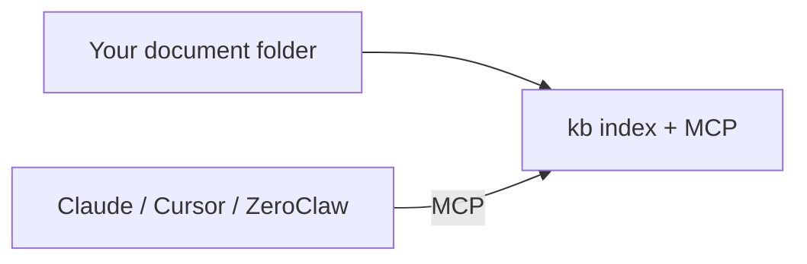

# Connect your documents to an agent

Use glossa as a **local knowledge base** over a folder on your computer. Agents call MCP tools (`search`, `read`, `grep`, …) instead of uploading files into the chat.

## Overview



1. **Pick a corpus folder** — any directory with your files (e.g. `~/Documents/work-kb`, a project repo, a synced cloud folder).
2. **Index once** — `kb index /path/to/folder` (see [install.md](install.md)).
3. **Connect an MCP client** — stdio (desktop) or HTTP (service).

Your files are never copied into the agent runtime. glossa reads them from disk and keeps a rebuildable index under `.glossa/`.

## Choose a transport

| Transport | When to use | How |
|-----------|-------------|-----|
| **stdio** | Single user, Claude Desktop, Cursor, ZeroClaw on same machine | Client spawns `kb mcp … --transport stdio` |
| **streamable-http** | Shared local service, multiple clients, remote gateway | Run `kb mcp … --transport streamable-http --bind 127.0.0.1:8080`; clients use `http://127.0.0.1:8080/mcp` |

For most desktop setups, **stdio is simplest** — no open port, no separate service.

### stdio command

Replace `/path/to/my-documents` with your corpus root and use the installed `kb` path:

```bash
kb mcp /path/to/my-documents --profile reader --transport stdio
```

- **`reader`** — search, read, grep, glossary (recommended for Q&A agents).
- **`editor`** — adds index, graph_upsert, graph_generalize (for agents that maintain the reasoning graph).

## Claude Desktop

Edit the MCP config (location varies by OS):

- **macOS:** `~/Library/Application Support/Claude/claude_desktop_config.json`
- **Windows:** `%APPDATA%\Claude\claude_desktop_config.json`

```json
{
  "mcpServers": {
    "glossa": {
      "command": "/usr/local/bin/kb",
      "args": [
        "mcp",
        "/path/to/my-documents",
        "--profile",
        "reader",
        "--transport",
        "stdio"
      ]
    }
  }
}
```

On Windows, set `command` to `C:\\Program Files\\glossa\\…\\kb.exe` (escape backslashes in JSON).

Restart Claude Desktop after saving.

## Cursor

Project-level (`.cursor/mcp.json` in your repo) or user MCP settings:

```json
{
  "mcpServers": {
    "glossa": {
      "command": "/usr/local/bin/kb",
      "args": ["mcp", "/path/to/my-documents", "--profile", "reader", "--transport", "stdio"]
    }
  }
}
```

For HTTP when glossa runs as a service:

```json
{
  "mcpServers": {
    "glossa": {
      "url": "http://127.0.0.1:8080/mcp"
    }
  }
}
```

Match `--bind` and `--allowed-host` on the server. Details: [mcp.md](mcp.md#ide-configuration).

## ZeroClaw

Add glossa to `~/.zeroclaw/config.toml`. Full walkthrough: [integrations/zeroclaw.md](integrations/zeroclaw.md).

## Other MCP clients

Any client that supports **stdio MCP** can use the same `command` + `args` as Claude Desktop. The corpus path must be readable by the user account that runs `kb`.

## Typical agent workflow

Once connected, the model can:

1. **`search`** or **`grep`** — find relevant chunks (`[#n]` in results).
2. **`read(path, n)`** — open full chunk text.
3. **`glossary` / `neighbors`** — follow reasoning-graph chains (when graph is populated).

Tool list: [mcp.md](mcp.md).

## Keeping documents fresh

After the first `kb index`, glossa **stat-scans** the corpus before reads. Drop a new PDF into the folder — the next agent query indexes it automatically. Manual refresh:

```bash
kb index /path/to/my-documents
```

## Run as a background service

If you prefer HTTP or want glossa always running (e.g. shared on a LAN via reverse proxy):

→ [deploy/service.md](deploy/service.md)

## Related

- [install.md](install.md) — download release binary
- [mcp.md](mcp.md) — profiles and tools
- [integrations/zeroclaw.md](integrations/zeroclaw.md) — ZeroClaw config
