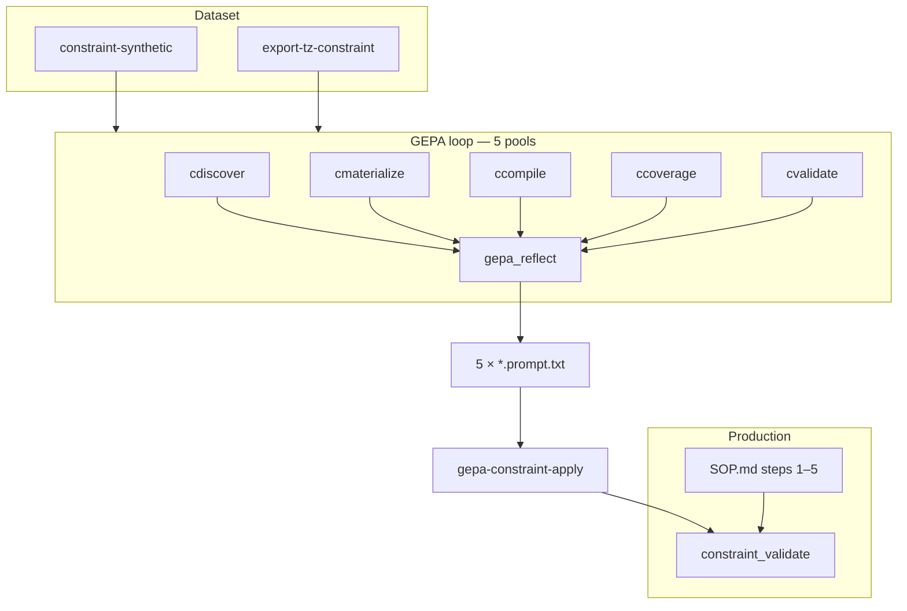

# Constraint GEPA — prompt optimization for limit tables

Playbook for GEPA optimization of the `constraint_validate` agent (phase A: extract `.csp` limit tables from regulatory documents).

The agent follows a **5-step SOP**: Discover → Materialize → Compile → Coverage → Validate. Constraint GEPA uses **five micro-task pools** (one per step) during optimization; production remains **one agent** with five merged prompt slices.

See also: [eval-and-training.md](eval-and-training.md), [constraint-tables-compiler.md](constraint-tables-compiler.md), [eval/results/constraint-runs.md](../eval/results/constraint-runs.md).

---

## Why this exists

`kb-eval-constraint` shows the main gap on small models is **valid_pass**: the agent under-captures allowed values in `.csp` files. Failures cluster by SOP step:

| SOP step | Typical failure |
|----------|-----------------|
| 1 Discover | misses referenced standards / full domain tables |
| 2 Materialize | incomplete `.csp`, TableEcho reject, incremental `graph_build` fail |
| 3 Compile | full-set `graph_build` fail after all tables written |
| 4 Coverage | `graph_stats` gaps (`to source` / `to value`) |
| 5 Validate | `constraint_solve` rejects valid markings |

GEPA optimizes **per-step SOP bodies** with isolated micro-functions. Production `constraint_validate` uses a **light system prompt** plus step text from `SOP.md` at runtime.

**In the GEPA loop:** step-specific hits (retrieval, table recall, compile OK, coverage closed, validate probes).  
**Sanity after apply:** full `kb-eval-constraint` run (all marking rows) — not scored every GEPA iteration.

---

## Architecture (5 pools ↔ 5 SOP steps)



### Micro-functions for training ≠ subagents in production

Same pattern as main GEPA (`search`/`grep`/`glob`/`read` → one `answer_hotpot`):

| GEPA pool | TZ function | SOP step | SOP anchor in `SOP.md` |
|-----------|-------------|----------|-------------------------|
| discover | `cdiscover` | 1 Discover | `{# GEPA:DISCOVER_* #}` |
| materialize | `cmaterialize` | 2 Materialize | `{# GEPA:MATERIALIZE_* #}` |
| compile | `ccompile` | 3 Compile | `{# GEPA:COMPILE_* #}` |
| coverage | `ccoverage` | 4 Coverage | `{# GEPA:COVERAGE_* #}` |
| validate | `cvalidate` | 5 Validate | `{# GEPA:VALIDATE_* #}` |

`gepa-constraint-apply` merges five artifacts into `eval/sops/gost-constraints/SOP.md`. `constraint_validate/system.minijinja` stays a short role + corpus/notebook contract. Anchor marker lines are stripped before the agent sees step body text.

### Migration from 3-pool design

| Legacy (3 pools) | 5-pool mapping |
|----------------|----------------|
| `cresearch` | → `cdiscover` |
| `cmaterialize` | → `cmaterialize` (+ incremental compile in scorer) |
| `ccompile_fix` | split → `ccompile` (step 3) + `ccoverage` (step 4) + `cvalidate` (step 5) |
| `GEPA:RESEARCH_*` | → `GEPA:DISCOVER_*` |
| `GEPA:COMPILE_FIX_*` | split into `GEPA:COMPILE_*`, `GEPA:COVERAGE_*`, `GEPA:VALIDATE_*` |

Keep backward-compatible TZ aliases (`cresearch` = `cdiscover`) for one release if needed.

---

## Five micro-task pools — scoring

| Pool | Input (prefill) | Model output | Hit |
|------|-----------------|--------------|-----|
| **discover** | Question about doc/parameter | `grep`/`read` tool call | gold chunk `path#loc` in top-k |
| **materialize** | workbook excerpt + parameter | `.csp` TSV body | `value_recall ≥ θ` **and** per-table `graph_build OK` |
| **compile** | full broken `.csp` set + compiler error | fixed `.csp` set | full-set `graph_build OK` |
| **coverage** | `graph_stats` report with gaps | `.csp` patch / rewritten table | gaps closed on re-run `graph_stats` |
| **validate** | compiled graph + probe markings | `.csp` fix (text) or tool trace | probe valid accepted + invalid rejected by `constraint_solve` |

**Default weights:**

```
gepa_c_combined = (
  0.25·discover + 0.30·materialize + 0.15·compile + 0.20·coverage + 0.10·validate
) / sum(active_weights)
```

Configurable via `kb-train optimize-constraint` (`--w-discover`, `--w-materialize`, …).

### Scoring implementation notes

| Pool | Scorer module | Notes |
|------|---------------|-------|
| discover | reuse `gepa.rs` grep/read helpers | Corpus index from `--work` |
| materialize | `constraint_score.rs` + temp `graph_build` | Write one `.csp` to notes mirror, compile |
| compile | `constraint_score.rs` + `graph_build` | Full multi-file set in temp dir |
| coverage | `checklist_coverage` + `graph_stats` | Parse report lines `to source` / `to value` |
| validate | `constraint_solve` on probe set | ~20 rows from reference cases, not full eval |

Table value recall (`value_recall`, `domain_covers`) remains the core signal for materialize/compile; coverage/validate add graph-level gates from steps 4–5.

---

## Prompt slices (what each optimizes)

### Discover (step 1)

- Corpus search: marking example anchor, referenced standards, full domain tables.
- Workbook is optional draft, not a hard gate.
- **Does not** create `.csp`.

### Materialize (step 2)

- TSV `.csp` from notebook only (no corpus).
- TableEcho / REJECTED handling.
- **Incremental** `graph_build` after each table.

### Compile (step 3)

- Full-set `graph_build` fix loop.
- Compiler errors → `sed`/`note` → retry until OK.

### Coverage (step 4)

- Read `graph_stats(doc)` checklist: sourced / to source, valued / to value.
- Close gaps before advance; may edit `.csp` and recompile.

### Validate (step 5)

- `constraint_solve` validate/check modes.
- On failure: fix tables, optionally re-run compile + coverage.
- Then `done`.

---

## Dataset pipeline

### Synthetic bootstrap

```bash
just constraint-synthetic
```

Writes to `gepa-constraint-out/`:

| File | Content |
|------|---------|
| `discover.jsonl` | oracle grep/read targets |
| `materialize.jsonl` | workbook excerpt → gold `.csp` |
| `compile.jsonl` | broken full set + error → gold set |
| `coverage.jsonl` | partial graph_stats report → gold fix |
| `validate.jsonl` | probe markings + expected solve outcome |

Generators live in `eval/src/constraint_synthetic.rs`.

### Episode export

```bash
just export-tz-constraint run=my-eval-run
```

Parses `constraint_validate` transcripts:

| SOP step | Export signal |
|----------|---------------|
| 1 | early `grep`/`read` |
| 2 | `note(*.csp)`, incremental `graph_build` |
| 3 | full-set `graph_build FAILED` → fix |
| 4 | `graph_stats` → subsequent `.csp` edits |
| 5 | `constraint_solve` fail → fix trace |

Gold join: `tags.doc` + parameter → reference table JSON under `--val-dir`.

---

## GEPA optimize + apply

```bash
just gepa-constraint budget=6 run=my-gepa-c
just gepa-constraint-metrics
just gepa-constraint-apply
just gw-restart
```

**Artifacts (5 files):**

```
gepa-constraint-out/
  constraint_discover.prompt.txt
  constraint_materialize.prompt.txt
  constraint_compile.prompt.txt
  constraint_coverage.prompt.txt
  constraint_validate.prompt.txt
```

**Apply** replaces text between matching `{# GEPA:*_START #}` … `{# GEPA:*_END #}` anchors in `eval/sops/gost-constraints/SOP.md`.

**Sanity-check** (full eval, outside loop):

```bash
kb-eval-constraint --kb <corpus> --val-dir <reference-tables> --tag run=gepa-c-applied
```

---

## CLI (`kb-train optimize-constraint`)

| Flag | Default | Meaning |
|------|---------|---------|
| `--discover` | `gepa-constraint-out/discover.jsonl` | Discover pool |
| `--materialize` | `…/materialize.jsonl` | Materialize pool |
| `--compile` | `…/compile.jsonl` | Compile pool |
| `--coverage` | `…/coverage.jsonl` | Coverage pool |
| `--validate` | `…/validate.jsonl` | Validate pool |
| `--out-dir` | `gepa-constraint-out` | All prompt outputs |
| `--hit-threshold` | 0.5 | Materialize value recall |
| `--w-discover` | 0.25 | Combined weight |
| `--w-materialize` | 0.30 | |
| `--w-compile` | 0.15 | |
| `--w-coverage` | 0.20 | |
| `--w-validate` | 0.10 | |

Reflect mutates **one slice per iteration** (pool with most minibatch failures).

---

## Just recipes

| Recipe | Purpose |
|--------|---------|
| `just constraint-synthetic` | Bootstrap 5 jsonl files |
| `just export-tz-constraint [run=…]` | Episodes → jsonl |
| `just gepa-constraint` | Synthetic + optimize |
| `just gepa-constraint-metrics` | ClickHouse `gepa_c_*` table |
| `just gepa-constraint-reset` | Clear constraint GEPA history |
| `just gepa-constraint-apply` | Merge 5 slices → prod |

---

## Code map (target after refactor)

| Path | Role |
|------|------|
| `eval/src/constraint_score.rs` | Table recall + temp-dir compile helpers |
| `eval/src/constraint_synthetic.rs` | 5 jsonl generators |
| `eval/src/gepa_constraint.rs` | 5-pool GEPA loop |
| `eval/src/export_tz_constraint.rs` | 5-way episode export |
| `eval/tensorzero/config/constraint_discover/` | Discover micro-prompt |
| `eval/tensorzero/config/constraint_materialize/` | Materialize micro-prompt |
| `eval/tensorzero/config/constraint_compile/` | Compile micro-prompt |
| `eval/tensorzero/config/constraint_coverage/` | Coverage micro-prompt |
| `eval/tensorzero/config/constraint_validate_micro/` | Validate micro-prompt (not prod template) |
| `eval/tensorzero/config/constraint_validate/system.minijinja` | Prod prompt + 5 anchors |

> **Naming:** prod agent template stays `constraint_validate/`; the step-5 GEPA micro-prompt directory should not collide — use `constraint_validate_micro/` or `constraint_solve_prompt/`.

---

## TensorZero metrics (`gepa_c_*`)

Per pool: `gepa_c_baseline_<pool>`, `gepa_c_iter_<pool>`, `gepa_c_final_<pool>`, plus `gepa_c_combined_acc`, `gepa_c_candidates`.

Legacy names (`gepa_c_baseline_research`, `compile_fix`) deprecated after migration.

---

## Implementation checklist

Refactor from current 3-pool code to 5-pool:

- [x] Split `SOP.md` anchors: `DISCOVER`, `MATERIALIZE`, `COMPILE`, `COVERAGE`, `VALIDATE`
- [x] Slim `constraint_validate/system.minijinja` (role + corpus/notebook only)
- [x] Add TZ functions `cdiscover`, `ccompile`, `ccoverage`, `cvalidate`; extend `cmaterialize` scorer
- [ ] Extend `constraint_score.rs`: `materialize_hit(csp, gold, doc, root)` with incremental compile
- [ ] Add `coverage_score.rs` or helpers: parse `checklist_coverage_report`, re-check after fix
- [ ] Add `validate_score.rs`: run `constraint_solve` on probe subset
- [x] Rewrite `gepa_constraint.rs`: 5 pools, 5 slice reflect, 5-way combined metric
- [x] Extend `constraint_synthetic.rs` + `export_tz_constraint.rs` for compile/coverage/validate jsonl
- [x] Update `kb-train optimize-constraint` flags and 5 prompt outputs
- [x] Update `gepa-constraint-apply` for 5 SOP step files
- [x] Update `gepa-constraint-metrics` / `gepa-constraint-reset` SQL
- [x] Deprecate `cresearch`, `ccompile_fix`, `compile_fix.jsonl` (shim one release)

---

## Troubleshooting

| Symptom | Check |
|---------|-------|
| Materialize pool always 0 | Incremental `graph_build` fails — scorer now requires compile OK |
| Coverage pool empty | Export not capturing `graph_stats` traces |
| Validate pool slow | Reduce probe count in synthetic jsonl |
| Apply fails on anchor | Check `{# GEPA:*_START #}` markers in `SOP.md` |
| Stale system-prompt slices | GEPA no longer applies to `system.minijinja` — optimize SOP bodies |

---

## Comparison with main GEPA

| | Main GEPA | Constraint GEPA (5-pool) |
|---|-----------|--------------------------|
| Target | `answer_hotpot` | `constraint_validate` |
| Pools | 4 (search/grep/glob/read) | 5 (discover/materialize/compile/coverage/validate) |
| Gold | chunk `path#loc` | reference tables + graph/solver probes |
| Output dir | `gepa-out/` | `gepa-constraint-out/` |
| Apply | `gepa-apply` | `gepa-constraint-apply` (5 slices) |

Both use `gepa_reflect` and TensorZero ClickHouse feedback.
