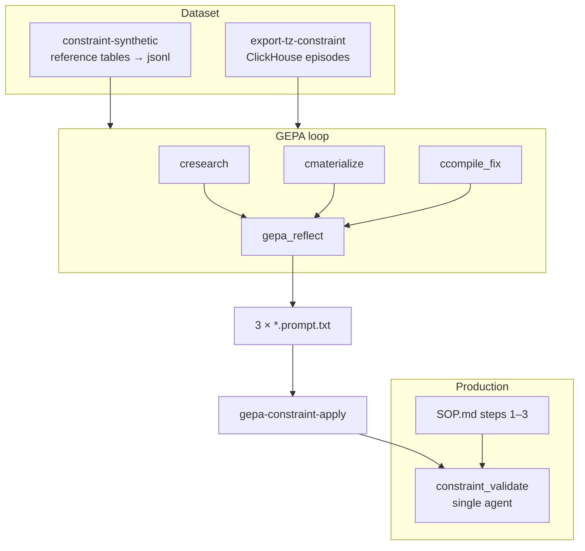

# Constraint GEPA — prompt optimization for limit tables

Playbook for GEPA optimization of the `constraint_validate` agent (phase A: extract `.csp` limit tables from regulatory documents).

See also: [eval-and-training.md](eval-and-training.md) (main GEPA for `answer_hotpot`), [constraint-tables-compiler.md](constraint-tables-compiler.md) (`.csp` → graph compiler), [eval/results/constraint-runs.md](../eval/results/constraint-runs.md) (eval run log).

---

## Why this exists

`kb-eval-constraint` shows the main gap on qwen3.5-4b is **valid_pass**: the agent under-captures allowed values in `.csp` files (value coverage `l` ≈ 0.66–0.71). Typical causes:

- **Step 1:** does not open referenced standards and full domain tables.
- **Step 2:** materializes incomplete `.csp` from an incomplete workbook.
- **Step 3:** fixes syntax but does not recover missing values.

Constraint GEPA improves the system prompt on **table quality before graph compilation**, analogous to quad GEPA for `answer_hotpot`.

**Optimized in the loop:** `.csp` value recall vs reference validation tables.  
**Not optimized in the loop:** end-to-end `acc` on marking rows, graph metrics `f/c/l` — sanity-check only after apply.

---

## Architecture



### Micro-functions for training ≠ subagents in production

As in main GEPA (`search` / `grep` / `glob` / `read` → one `answer_hotpot`), three TZ functions exist only for **isolated scoring** during optimization:

| GEPA (TensorZero) | What it trains | Production (runtime) |
|-------------------|----------------|---------------------|
| `cresearch` | grep/read/glob/search on step 1 | Single `constraint_validate` |
| `cmaterialize` | `.csp` from workbook | + SOP step instructions |
| `ccompile_fix` | fix `.csp` from compiler errors | |

After `gepa-constraint-apply`, three optimized slices merge into `constraint_validate/system.minijinja` at `{# GEPA:* #}` anchors.

---

## Three micro-task pools

| Pool | TZ function | Input | Hit |
|------|-------------|-------|-----|
| **research** | `cresearch` | Question about doc/parameter | gold chunk `path#loc` in top-k grep |
| **materialize** | `cmaterialize` | workbook excerpt + parameter | value recall ≥ `hit_threshold` (default 0.5) |
| **compile-fix** | `ccompile_fix` | broken `.csp` + compiler error | same recall on fixed `.csp` |

**Combined metric:**

```
gepa_c_combined = (0.35·research + 0.45·materialize + 0.20·compile_fix) / sum(weights)
```

Weights are configurable in `kb-train optimize-constraint` (`--w-research`, `--w-materialize`, `--w-compile-fix`).

Table scoring: `eval/src/constraint_score.rs` (`value_recall`, `domain_covers`) — same semantics as `compare_tables_by_domain` in `kb-eval-constraint`.

---

## Prerequisites

1. **Build:** `just build` (needs `kb-train`)
2. **TensorZero + ClickHouse:** `just up` (for optimize and export)
3. **LM Studio:** Qwen3.5-4B on `:1234` — micro-task scoring
4. **OpenRouter:** `gepa_reflect` / DeepSeek-R1 (see [eval/tensorzero/README.md](../eval/tensorzero/README.md))
5. **Reference tables:** JSON validation sets under `--val-dir` (local, gitignored)
6. **Indexed corpus:** `--work` / `--kb` with the owner document indexed (for research pool)

---

## Playbook 1 — Bootstrap dataset (synthetic)

No ClickHouse episodes required:

```bash
just constraint-synthetic
```

Writes to `gepa-constraint-out/` (gitignored):

| File | Source |
|------|--------|
| `materialize.jsonl` | reference table JSON — oracle workbook + gold `.csp` |
| `compile_fix.jsonl` | mutated gold (truncated values) + synthetic compiler error |
| `research.jsonl` | `eval/fixtures/constraint-research-gold.json` — oracle grep targets |

Direct CLI:

```bash
kb-train synthetic-constraint \
  --val-dir <reference-tables-dir> \
  --doc <owner-document.pdf> \
  --out gepa-constraint-out
```

Defaults match `kb-train synthetic-constraint --help`.

---

## Playbook 2 — GEPA optimize

```bash
just gepa-constraint budget=6 minibatch=8 run=my-gepa-c
```

Equivalent:

```bash
kb-train optimize-constraint \
  --research gepa-constraint-out/research.jsonl \
  --materialize gepa-constraint-out/materialize.jsonl \
  --compile-fix gepa-constraint-out/compile_fix.jsonl \
  --out-dir gepa-constraint-out \
  --out gepa-constraint-out/constraint_materialize.prompt.txt \
  --work <indexed-corpus> \
  --budget 6 --minibatch 8 \
  --tag run=my-gepa-c
```

**Artifacts:**

| File | Purpose |
|------|---------|
| `constraint_research.prompt.txt` | optimized step-1 slice |
| `constraint_materialize.prompt.txt` | optimized step-2 slice |
| `constraint_compile_fix.prompt.txt` | optimized step-3 fix-loop slice |

Seed: if `*.prompt.txt` already exist, continues from them; otherwise reads `eval/tensorzero/config/constraint_*/system.minijinja`.

**ClickHouse metrics:**

```bash
just gepa-constraint-metrics
```

Key metrics: `gepa_c_baseline_*`, `gepa_c_combined_acc`, `gepa_c_final_materialize`, `gepa_c_final_research`, `gepa_c_final_compile_fix`.

Reset history:

```bash
just gepa-constraint-reset
# wait ~5s
just gepa-constraint-metrics
```

---

## Playbook 3 — Export from real episodes

After `kb-eval-constraint` runs tagged with `run=…`:

```bash
just export-tz-constraint run=my-eval-run
```

Parses `constraint_validate` episodes from ClickHouse:

- `note(…, file="*.csp")` → materialize rows
- step-1 `grep`/`read` → research rows
- `graph_build FAILED` → `sed`/`note` → compile-fix rows

Gold join: `tags.doc` + parameter name → reference table JSON under `--val-dir`.

Merge synthetic + exported jsonl before optimize (or overwrite files in `gepa-constraint-out/`).

---

## Playbook 4 — Apply to production + sanity-check

```bash
just gepa-constraint-apply
just gw-restart
```

`gepa-constraint-apply`:

1. Checks all three `*.prompt.txt` exist in `gepa-constraint-out/`
2. Copies backup `system.minijinja.bak`
3. Replaces text between `{# GEPA:RESEARCH_START #}` … `{# GEPA:RESEARCH_END #}` (and MATERIALIZE, COMPILE_FIX likewise)

**Sanity-check** (outside GEPA loop):

```bash
kb-eval-constraint \
  --kb <indexed-corpus> \
  --val-dir <reference-tables-dir> \
  --tag run=gepa-c-applied
```

Expect higher value recall / `valid_pass` with stable `invalid_catch`. If recall improves but `acc` is flat, inspect field mapping or the compiler — not the prompt.

---

## Full cycle (production checklist)

```bash
just build-train force
just up
just gw-restart

# 1. Dataset
just constraint-synthetic
# optional after eval run:
just export-tz-constraint run=my-eval-run

# 2. Optimize
just gepa-constraint budget=6 run=gepa-c-v1

# 3. Review + apply
just gepa-constraint-metrics
# review gepa-constraint-out/*.prompt.txt
just gepa-constraint-apply
just gw-restart

# 4. Sanity
kb-eval-constraint --tag run=gepa-c-v1-applied ...
```

---

## CLI reference (`kb-train`)

| Subcommand | Purpose |
|------------|---------|
| `synthetic-constraint` | Bootstrap jsonl from reference tables |
| `export-tz-constraint` | Episodes → jsonl |
| `optimize-constraint` | GEPA loop, 3 prompt slices |

### `optimize-constraint` — main flags

| Flag | Default | Meaning |
|------|---------|---------|
| `--budget` | 6 | Reflect→mutate iterations |
| `--minibatch` | 8 | Failure traces per iteration |
| `--hit-threshold` | 0.5 | Value recall threshold for hit |
| `--val-frac` | 0.3 | Val fraction by `episode_id` |
| `--pareto-size` | 20 | D_pareto sample size |
| `--w-research` | 0.35 | Research weight in combined |
| `--w-materialize` | 0.45 | Materialize weight |
| `--w-compile-fix` | 0.20 | Compile-fix weight |
| `--work` | kb-test | Corpus for research grep scoring |

---

## Just recipes

| Recipe | When |
|--------|------|
| `just constraint-synthetic` | Bootstrap jsonl |
| `just export-tz-constraint [run=…]` | Episodes → jsonl |
| `just gepa-constraint [budget=…] [run=…]` | Synthetic + optimize |
| `just gepa-constraint-metrics` | Metrics table in terminal |
| `just gepa-constraint-reset` | Clear CH history |
| `just gepa-constraint-apply` | Merge → prod prompt |

---

## Repository files

| Path | Role |
|------|------|
| `eval/src/constraint_score.rs` | Table value recall scorer |
| `eval/src/constraint_synthetic.rs` | Synthetic jsonl generator |
| `eval/src/gepa_constraint.rs` | GEPA loop (triple pool) |
| `eval/src/export_tz_constraint.rs` | ClickHouse export |
| `eval/tensorzero/config/constraint_research/` | Research micro-prompt |
| `eval/tensorzero/config/constraint_materialize/` | Materialize micro-prompt |
| `eval/tensorzero/config/constraint_compile_fix/` | Compile-fix micro-prompt |
| `eval/tensorzero/config/constraint_validate/system.minijinja` | Prod prompt + GEPA anchors |
| `eval/fixtures/constraint-research-gold.json` | Oracle research targets |

---

## Troubleshooting

| Symptom | Check |
|---------|-------|
| `wrote 0 rows` in synthetic | `--val-dir` populated? JSON files not prefixed with `_`? |
| baseline 0.000 | LM Studio up? `just gw-restart`? Corpus indexed (`kb reindex`)? |
| `Unknown function: cmaterialize` | Gateway on stale config — `just gw-restart` |
| `missing research prompt` on apply | All 3 `*.prompt.txt` required — run full `optimize-constraint` |
| `anchor GEPA:* not found` | `system.minijinja` missing anchors — restore from git |
| GEPA recall ↑, acc flat | Field mapping / compiler — not prompt |

---

## Comparison with main GEPA

| | Main GEPA | Constraint GEPA |
|---|-----------|-----------------|
| Target agent | `answer_hotpot` | `constraint_validate` |
| Pools | search, grep, glob, read | research, materialize, compile-fix |
| Gold | `path#loc` chunks | reference table value domains |
| Output dir | `gepa-out/` | `gepa-constraint-out/` |
| Apply | `just gepa-apply` | `just gepa-constraint-apply` |
| Metrics prefix | `gepa_*` | `gepa_c_*` |

Both use `gepa_reflect` (DeepSeek-R1) and TensorZero ClickHouse feedback.
