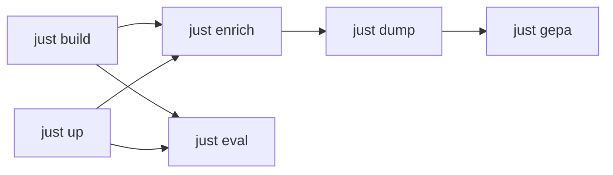

# Eval and training

This guide is for **developers** benchmarking glossa or running the graph enricher. Corpus operators can ignore most of this — see [getting-started.md](getting-started.md).

## Binaries

| Binary | Crate | Purpose |
|--------|-------|---------|
| `kb` | `glossa` | Index, search, MCP server |
| `kb-eval` | `kb-eval` | Run benchmark datasets, score answers |
| `kb-train` | `kb-eval` | Enrich graph, dump supervision, GEPA optimize |

Build all release binaries:

```bash
just build
# or
cargo build --workspace --release
```

Binaries land in `target/release/`. Use release builds for long enrich runs; a debug `kb-train` process can lock the executable on Windows and block rebuilds.

## just pipeline

Install [just](https://github.com/casey/just), then:

```bash
just --list
```

Typical flow (paths in `justfile` default to local dev corpora — override via recipe args where supported):



| Recipe | Action |
|--------|--------|
| `just build` | Release build entire workspace |
| `just test` | `cargo test --workspace --release` |
| `just up` | Start TensorZero stack (Docker) |
| `just down` | Stop TensorZero stack |
| `just tools` | Regenerate MCP tool schemas for TensorZero |
| `just enrich` | Run `kb-train enrich` on train cases |
| `just dump` | Export `query.jsonl` + `select.jsonl` to `gepa-out/` |
| `just gepa` | GEPA-optimize select prompt via TensorZero |
| `just eval dataset=...` | End-to-end benchmark through TZ agent |
| `just eval-fixture` | Smoke-test eval on committed sample dataset (mock backend) |
| `just graph-stats` | `kb graph stats` on work corpus |

Default work corpus: `kb-test/` (git-ignored). Train cases: `kb-val/derived/synthetic-train.json`.

### Enrich

Reverse-traces solved cases into reasoning-graph edges:

```bash
just enrich          # all cases
just enrich 10       # first 10 only
```

Long runs: launch detached (`nohup just enrich > enrich.log 2>&1 &` on Unix).

### Eval

```bash
just eval kb-val/derived/test.json
```

Runs `kb-eval` with TensorZero backend against `eval-corpus/` by default. See [`eval/tensorzero/README.md`](../eval/tensorzero/README.md) for gateway setup, models, and `.env` secrets.

Smoke-test without local corpora or TensorZero:

```bash
just eval-fixture
# or
kb-eval run --dataset eval/fixtures/sample-hotpot-distractor.json --backend mock
```

## Dataset format

`kb-eval run` accepts a JSON array in **HotpotQA distractor** shape (parsed by [`eval/src/dataset.rs`](../eval/src/dataset.rs)). Each item becomes a mini-corpus: one markdown file per `context` title, then the agent is scored on answer EM/F1 and retrieval recall.

Committed sample: [`eval/fixtures/sample-hotpot-distractor.json`](../eval/fixtures/sample-hotpot-distractor.json) (fictional English content — safe to ship in the repo).

| Field | Type | Role |
|-------|------|------|
| `_id` | string | Question id |
| `question` | string | Agent question |
| `answer` | string | Gold answer (EM/F1) |
| `context` | `[title, sentences[]][]` | Paragraphs → one `.md` file per title |
| `supporting_facts` | `[title, sentence_index][]` | Gold retrieval titles (deduped for recall) |

Example (abbreviated):

```json
[
  {
    "_id": "sample_q1",
    "question": "Which city hosts the Acme factory?",
    "answer": "Riverdale",
    "context": [
      ["Riverdale", ["Riverdale is a city in the north.", "The Acme factory opened there in 1998."]],
      ["Springfield", ["Springfield is unrelated to Acme."]]
    ],
    "supporting_facts": [["Riverdale", 1]]
  }
]
```

For **`kb-train enrich`**, use a simpler JSON array of solved cases: `[{_id, question, answer}]`. Sample: [`eval/fixtures/sample-train.json`](../eval/fixtures/sample-train.json).

### GEPA

```bash
just dump
just gepa 6 4 baseline my-run-v1
just gepa-metrics
```

Optimizes the `select` function prompt; metrics land in ClickHouse (TensorZero UI).

## kb-eval backends

`kb-eval run` supports multiple backends (mock, openai function-calling loop, cli subprocess, tensorzero). The OpenAI backend runs glossa tools **in-process** against `--work` — no MCP server required for eval.

Per-question timeouts: `--timeout-secs`.

## Benchmark history

Append-only run log: [benchmarks.md](benchmarks.md).

HotpotQA distractor results (50 questions, same engine):

| Reader | EM | F1 | Recall |
|--------|-----|-----|--------|
| Qwen3.5-4B | 0.68 | 0.81 | 0.99 |
| Claude | 0.80 | 0.90 | 0.93 |

Interpretation: retrieval recall was already high with the small model; stronger readers lift answer EM/F1. glossa measures **agent + tools**, not a fine-tuned reader.

## Artifacts (git-ignored)

| Path | Contents |
|------|----------|
| `kb-test/`, `kb-val/` | Local corpora |
| `eval-corpus/` | Eval working copy |
| `eval-*.json` | Run reports |
| `gepa-out/` | Dump + optimized prompts |
| `.glossa/` | Index and graph per corpus |

## TensorZero

Full gateway, ClickHouse, and UI setup: [eval/tensorzero/README.md](../eval/tensorzero/README.md).

After MCP tool changes:

```bash
just tools
just gw-restart
```

## Related

- [graph-and-ontology.md](graph-and-ontology.md) — ontology for enrich
- [mcp.md](mcp.md) — tools the eval agent calls
- [ROADMAP.md](ROADMAP.md) — eval track backlog
