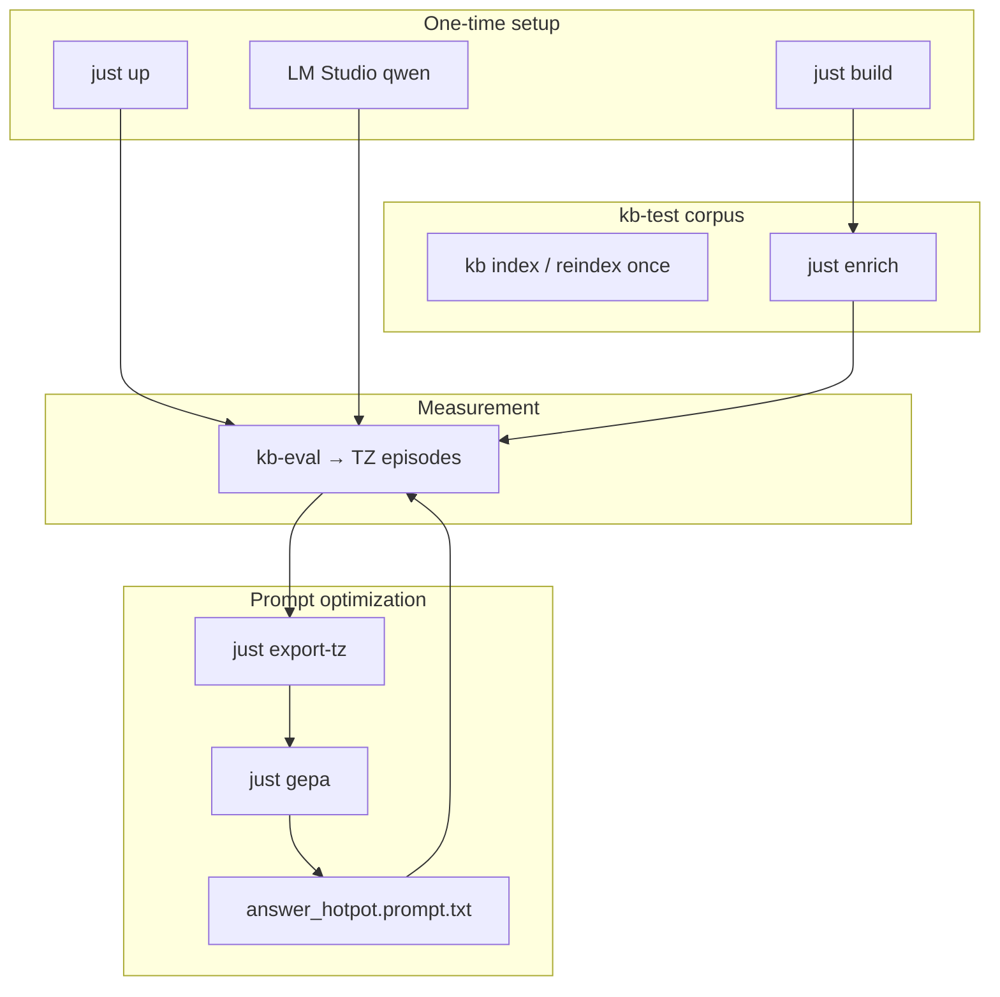

# Eval and training — playbook

Developer guide: run the agent, accumulate TensorZero telemetry, export a GEPA dataset, and improve the prod prompt. Corpus operators can skip most of this — see [getting-started.md](getting-started.md).

## Why this exists

glossa measures not a bare LLM but an **agent with tools** (`search`, `grep`, `glob`, `read`, graph, …). TensorZero (TZ) logs every run to ClickHouse: question, tool-call chain, metrics. From that history we:

1. **Export** — build labeled dumps of how the model searched, grepped, globbed, and read vs gold chunks.
2. **GEPA** — iteratively improve the system prompt (`answer_hotpot`) without changing agent code.
3. **Eval** — check end-to-end (answer, recall, judge) before and after.



---

## Playbook 0 — 2-minute smoke

No Docker, no corpus, no GPU:

```bash
just build
just eval-fixture
```

Confirms `kb-eval` builds and scoring works (mock backend, [sample-hotpot-distractor.json](../eval/fixtures/sample-hotpot-distractor.json)).

---

## Playbook 1 — First-time infrastructure

### 1. Build

```bash
just build          # kb + kb-eval + kb-train
just test           # optional
```

Binaries land in `target/release/`. On Windows use **`kb-eval.exe`** and **`kb-train.exe`** (release builds). After code changes: `just build-eval force` / `just build-train force`.

| Binary | Purpose |
|--------|---------|
| `kb` | index, search, MCP (shipped in GitHub Releases) |
| `kb-eval` | benchmark, scoring |
| `kb-train` | enrich, export-tz, GEPA optimize |

### 2. TensorZero + ClickHouse

```bash
cd eval/tensorzero
cp .env.example .env    # LMSTUDIO_API_KEY, OPENROUTER_API_KEY
just up
just health             # expect gateway 200
```

Details: [eval/tensorzero/README.md](../eval/tensorzero/README.md).

### 3. Models

| Role | Where | Used for |
|------|-------|----------|
| **Qwen3.5-4B** | LM Studio `:1234` | agent (`answer_hotpot`), GEPA micro-task scoring, optional judge |
| **DeepSeek-R1** | OpenRouter via TZ | GEPA reflect/mutate (`gepa_mutator`) |

After changing TZ tool schemas:

```bash
just tools
just gw-restart
```

---

## Playbook 2 — Corpus and reasoning graph

Default work corpus: **`kb-test/`** (git-ignored). Case registry: **`kb-val/derived/train.json`** + **`synthetic-train.json`**.

### Index once

Build or rebuild the search index **before** eval or GEPA (not per question):

```bash
./target/release/kb reindex kb-test    # Windows: kb.exe
```

TensorZero eval uses a **pre-built index** in `--work`; it does not wipe `.glossa` between questions.

### Enrich — silver graph from solved cases

```bash
just enrich          # all cases from synthetic-train.json
just enrich 10       # first 10 only
just graph-stats
```

The enricher reverse-traces Q→A into reasoning nodes. Gold for export can come from graph `MENTIONS` when train JSON has no `source` field.

---

## Playbook 3 — Eval: record episodes in ClickHouse

Eval = one question = one TZ **episode**. `export-tz` reads these later.

### Standard run

```bash
just eval kb-val/derived/synthetic-train.json answer_hotpot kb-test after-gepa
```

Positional args: `DATASET`, `FUNCTION`, `WORK`, **`RUN_TAG`** (4th). Sets `tags.run=after-gepa`. **`tags.case_id = _id`** is added from the dataset.

`just eval` also passes `--judge-endpoint http://localhost:1234 --judge-model qwen3.5-4b` (LM Studio must be up for judge metrics).

### Dataset formats

| Format | Used for | `context` field |
|--------|----------|-----------------|
| HotpotQA | mini-corpus per question (CLI/OpenAI backends) | required paragraphs |
| glossa-train (`synthetic-train.json`, `train.json`) | enrich + eval on fixed corpus | optional (empty OK) |

Parsed by [`eval/src/dataset.rs`](../eval/src/dataset.rs). Sample Hotpot: [sample-hotpot-distractor.json](../eval/fixtures/sample-hotpot-distractor.json). Sample train: [sample-train.json](../eval/fixtures/sample-train.json).

### After eval

```bash
just eval-metrics
```

Columns: `run`, `f1`, `recall_at_10`, `judge`.

---

## Playbook 4 — Export: episodes → GEPA dataset

Export **does not run the model**. It reads ClickHouse, parses tool calls from transcripts, labels against gold.

```bash
just export-tz                  # all answer_hotpot episodes
just export-tz gepa-v1          # only tags.run=gepa-v1
```

Output in `gepa-out/` (git-ignored):

| File | Contents |
|------|----------|
| `search.jsonl` | question, search_query, gold, hit@k |
| `grep.jsonl` | question, grep pattern, gold, hit@k |
| `glob.jsonl` | question, glob pattern, gold paths |
| `read.jsonl` | prefilled search hits, model read pick, hit/miss |

If episodes lack grep/glob tool calls, export **synthesizes** rows from registry cases.

### Gold join

1. **`tags.case_id`** → lookup in train/synthetic-train (best).
2. **Question text** (normalized) → fallback for old episodes.
3. Gold chunk: **`source`** field (`path#loc`) or graph **`MENTIONS`**.

Prefer explicit **`source`** on train cases over graph-only gold.

### Report line (example)

```
export-tz: episodes=160 skipped_no_q=1 skipped_no_gold=89 joined_by_id=42
  search=217 (hit=43) grep=49 (hit=8) glob=109 (hit=74) read=97 (hit=22)
```

| Field | Meaning |
|-------|---------|
| `joined_by_id` | Episodes matched via `case_id` (re-run eval with current `kb-eval` if 0) |
| `search` / `grep` / `glob` / `read` | Row counts — **what GEPA needs** |
| `hit` | Retrospective on that episode; GEPA re-scores live during optimize |

---

## Playbook 5 — GEPA: improve the prod prompt

Target: [`eval/tensorzero/config/answer_hotpot/system.minijinja`](../eval/tensorzero/config/answer_hotpot/system.minijinja).

GEPA scores four micro-tasks via TZ functions **`search`**, **`grep`**, **`glob`**, **`read`** — each with the evolving prod prompt passed as `input.system`.

### Quick run (dump already exists)

```bash
just gepa
just gepa-metrics
```

Artifact: **`gepa-out/answer_hotpot.prompt.txt`**.

### Full cycle

```bash
just gepa-all run=gepa-v1
# export-tz + optimize; auto run tag if omitted
```

### `just gepa` parameters (named)

| Param | Default | Meaning |
|-------|---------|---------|
| `budget` | `40` | Reflect→mutate iterations |
| `minibatch` | `12` | Failure traces per iteration (weighted across tools) |
| `w_search` | `0.35` | Combined metric weight |
| `w_read` | `0.40` | |
| `w_grep` | `0.15` | |
| `w_glob` | `0.10` | |
| `pareto-size` | `20` (in recipe) | D_pareto sample cap |
| `run` | `gepa-long-YYYYMMDD-HHMM` | TZ tag for metrics |

Examples:

```bash
just gepa budget=80 w_search=0.45 w_read=0.30 run=my-run
just gepa budget=12 minibatch=8
```

Seed: `gepa-out/answer_hotpot.prompt.txt` if present, else prod `system.minijinja`.

### Quad sub-tasks

| Sub-task | Model must | Score |
|----------|------------|-------|
| **search** | `search(query)` | gold chunk in top-k |
| **grep** | `grep(pattern)` | gold in grep hits |
| **glob** | `glob(pattern)` | gold path in listing |
| **read** | `read(path,n)` after prefilled hits | pick matches gold |

Combined: weighted average (`gepa_combined_acc`). Acceptance: minibatch improve → pool; **final pick** re-scores all candidates on **full val**.

### Production checklist

```bash
just build-train force
just gw-restart

just eval kb-val/derived/synthetic-train.json answer_hotpot kb-test gepa-v1
just export-tz gepa-v1
just gepa budget=40 run=gepa-v1

just gepa-metrics
# Review gepa-out/answer_hotpot.prompt.txt — apply manually when satisfied:
just gepa-apply
just gw-restart

just eval kb-val/derived/synthetic-train.json answer_hotpot kb-test gepa-v1-applied
just eval-metrics
```

**`gepa-apply` is manual** — copies optimized prompt to prod template (creates `.bak`; `.bak` is git-ignored).

---

## Playbook 6 — Reset ClickHouse history

```bash
just gepa-reset    # search/grep/glob/read/gepa_reflect + GEPA metrics
just eval-reset    # answer_hotpot* only
# wait ~5s
just gepa-metrics
just eval-metrics
```

Eval and GEPA history are independent.

---

## Recipe cheat sheet

| Recipe | When |
|--------|------|
| `just build` | After pull / code changes |
| `just build-eval force` / `just build-train force` | Force rebuild on Windows |
| `just up` / `just down` | TZ stack |
| `just enrich` | Build reasoning graph |
| `just eval DATASET [FUNC] [WORK] [RUN]` | Benchmark → episodes (+ judge) |
| `just export-tz [run]` | Episodes → four jsonl files |
| `just gepa [budget=…] [run=…]` | Optimize prompt |
| `just gepa-all` | export-tz + gepa |
| `just gepa-apply` | Copy optimized prompt → prod (manual step) |
| `just gepa-metrics` / `just eval-metrics` | Terminal tables |
| `just dump` | **Legacy** graph dump |
| `just graph-stats` | Graph size |

Full list: `just --list`.

---

## Troubleshooting

| Symptom | Check |
|---------|-------|
| `export-tz` search=0 | No episodes or no registry join; run eval on train questions |
| `joined_by_id=0` | Re-run eval with current `kb-eval` (needs `case_id` tag) |
| GEPA baseline 0.000 | Empty index → `kb reindex kb-test`; LM Studio up; `just gw-restart` |
| `Unknown function: search` | Gateway on old config — `just gw-restart` |
| `missing field context` | Stale `kb-eval` without `.exe` — `just build-eval force` |
| `indexed: N added` every question | Stale eval binary or Hotpot dataset with `context` paragraphs |
| Per-question reindex on kb-test | Use TensorZero backend (default in `just eval`); rebuild `kb-eval` |
| No `judge` in TZ metrics | LM Studio down or judge model missing |
| After tool schema changes | `just tools && just gw-restart` |

---

## kb-eval backends

| Backend | When |
|---------|------|
| `tensorzero` | Prod-like: TZ gateway + glossa tools in-process |
| `openai` | LM Studio / OpenAI without TZ |
| `cli` | External MCP client |
| `mock` | Unit smoke |

---

## Related

- [graph-and-ontology.md](graph-and-ontology.md) — ontology for enrich
- [benchmarks.md](benchmarks.md) — published eval numbers
- [mcp.md](mcp.md) — agent tools
- [ROADMAP.md](ROADMAP.md) — backlog
