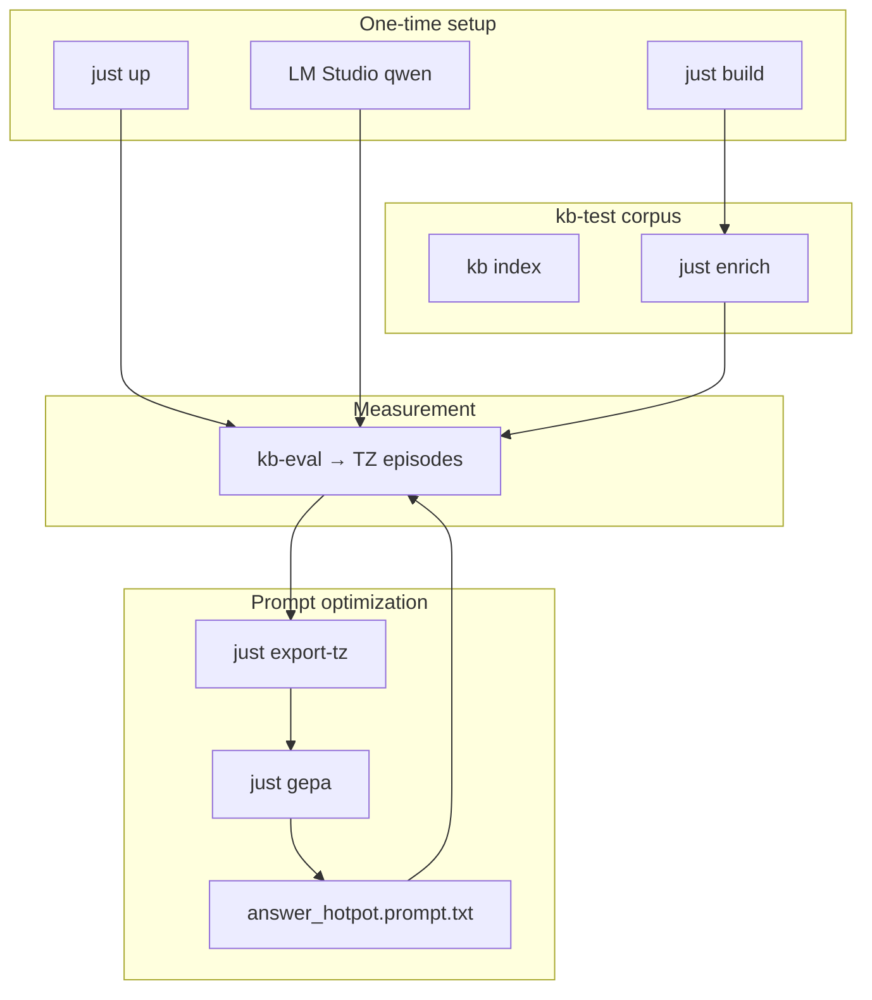

# Eval and training — playbook

Developer guide: run the agent, accumulate TensorZero telemetry, turn it into a GEPA dataset, and improve the prod prompt. Corpus operators can skip most of this — see [getting-started.md](getting-started.md).

## Why this exists

glossa measures not a bare LLM but an **agent with tools** (`search`, `read`, graph, …). TensorZero (TZ) logs every run to ClickHouse: question, tool-call chain, metrics. From that history we:

1. **Export** — build a labeled dump of how the model searched/read vs gold chunks.
2. **GEPA** — iteratively improve the system prompt (`answer_hotpot`) without changing agent code.
3. **Eval** — check end-to-end (answer, recall, judge) before and after.



---

## Playbook 0 — 2-minute smoke

No Docker, no corpus, no GPU:

```bash
just build
just eval-fixture
```

Confirms `kb-eval` builds and scoring works (mock backend, [sample-hotpot-distractor.json](../eval/fixtures/sample-hotpot-distractor.json)).

---

## Playbook 1 — First-time infrastructure

### 1. Build

```bash
just build          # kb + kb-eval + kb-train
just test           # optional
```

Binaries land in `target/release/`. On Windows, use **release** for long runs (debug locks the `.exe`).

| Binary | Purpose |
|--------|---------|
| `kb` | index, search, MCP |
| `kb-eval` | benchmark, scoring |
| `kb-train` | enrich, export-tz, GEPA |

### 2. TensorZero + ClickHouse

```bash
cd eval/tensorzero
cp .env.example .env    # LMSTUDIO_API_KEY, OPENROUTER_API_KEY
just up
just health             # expect gateway 200
```

Details: [eval/tensorzero/README.md](../eval/tensorzero/README.md).

### 3. Models

| Role | Where | Used for |
|------|-------|----------|
| **Qwen3.5-4B** | LM Studio `:1234` | agent (`answer_hotpot`, GEPA scoring) |
| **DeepSeek-R1** | OpenRouter via TZ | GEPA reflect/mutate |

After changing TZ tool schemas:

```bash
just tools
just gw-restart
```

---

## Playbook 2 — Corpus and reasoning graph (optional but useful)

Default work corpus: **`kb-test/`** (git-ignored). Case registry for export/GEPA: **`kb-val/derived/train.json`** + **`synthetic-train.json`**.

### Enrich — silver graph from solved cases

```bash
just enrich          # all cases from synthetic-train.json
just enrich 10       # first 10 only
just graph-stats     # node counts
```

The enricher reverse-traces Q→A into reasoning nodes (`Symptom` → `MENTIONS` → section). Needed for gold via the graph when JSON has no `source` field.

Long run (Unix):

```bash
nohup just enrich > enrich.log 2>&1 &
```

---

## Playbook 3 — Eval: record episodes in ClickHouse

Eval = one question = one TZ **episode**. `export-tz` reads these later.

### Standard run (HotpotQA and similar)

```bash
just eval path/to/dataset.json
```

Defaults: backend `tensorzero`, corpus `eval-corpus/`. Metrics: `just eval-metrics`.

### Tagged run (recommended for GEPA)

Pass a **`run`** label so export and metrics can filter by eval batch:

```bash
just eval kb-val/derived/synthetic-train.json answer_hotpot kb-test run=gepa-v1
```

That sets `tags.run=gepa-v1` on every inference. **`tags.case_id = _id`** is added automatically from the dataset — export joins gold by id without matching question text.

Extra tags (e.g. A/B arm): pass `--tag` directly to `kb-eval` after `just build-eval`.

> **Note:** `kb-eval run` expects Hotpot-shaped JSON (`context`, `supporting_facts`). The enrich format `[{_id, question, answer}]` is for `kb-train enrich` only. Export can use episodes from **any** past eval runs if the question or `case_id` is in the registry.

### After eval

```bash
just eval-metrics
```

Columns: `run`, `f1`, `recall_at_10`, `judge`.

---

## Playbook 4 — Export: episodes → GEPA dataset

Export **does not run the model**. It reads ClickHouse, parses `search` / `read` from the transcript, and labels against gold.

```bash
just export-tz                  # all answer_hotpot episodes
just export-tz gepa-v1          # only tags.run=gepa-v1
```

Output:

| File | Contents |
|------|----------|
| `gepa-out/query.jsonl` | question, search_query, gold, hit@k |
| `gepa-out/read.jsonl` | prefilled hits, model read, hit/miss |

### How gold is joined

1. **`tags.case_id`** → lookup in train/synthetic-train (best path; needs eval after rebuild).
2. **Question text** (whitespace-normalized) → fallback for old episodes.
3. Gold chunk: **`source`** field (`path#loc`) or graph **`MENTIONS`**.

### Reading the report line

**Reference baseline** (kb-test, export after path/gold fix, no `case_id` re-eval yet — 2026-06-30):

```
export-tz: episodes=160 skipped_no_q=1 skipped_no_gold=89 joined_by_id=0
  query=217 (hit=43) read=450 (hit=22)
```

Older broken export (path mismatch, all hits false):

```
export-tz: episodes=159 skipped_no_q=1 skipped_no_gold=88
  query=217 (hit=0) read=450 (hit=0) joined_by_id=0
```

| Field | Meaning |
|-------|---------|
| `episodes` | Unique episode_id rows in CH |
| `skipped_no_gold` | No registry match / no gold chunk |
| `query` / `read` | Rows in the dump — **what matters for GEPA** |
| `hit` | Retrospective: gold in top-k (query) or correct read(path,n) in **that** episode; GEPA re-scores live during optimize |
| `joined_by_id` | Episodes matched via `case_id` (0 = old runs without the tag) |

**You can run GEPA** when `query` and `read` are > 0.

---

## Playbook 5 — GEPA: improve the prod prompt

Target: **`eval/tensorzero/config/answer_hotpot/system.minijinja`**. Scoring goes through TZ **`functions.search`** (query stage) and **`functions.read`** (read stage) — isolated metrics channel, prod tools.

### Quick run (dump already exists)

```bash
just gepa 6 4 baseline gepa-smoke
just gepa-metrics
```

Artifact: **`gepa-out/answer_hotpot.prompt.txt`**.

### Full cycle from scratch

```bash
just gepa-all 6 4 baseline gepa-v1 gepa-v1
# export-tz (all runs) + optimize with run tag gepa-v1
```

### `just gepa B M V RUN` parameters

| # | Name | Example | Meaning |
|---|------|---------|---------|
| 1 | `budget` | `6` | Reflect→mutate iterations (DeepSeek-R1) |
| 2 | `minibatch` | `4` | Failures shown to the mutator per iteration (query + read) |
| 3 | `variant` | `baseline` | TZ variant in `tensorzero.toml` |
| 4 | `run` | `gepa-smoke` | Tag `run=…` in ClickHouse for `gepa-metrics` |

Windows: use **`just gepa 6 4`**, not `just gepa budget=6`.

### Two sub-tasks (one loop)

| Sub-task | Model must | Score |
|----------|------------|-------|
| **query** | Emit `search(query)` | gold chunk in top-k |
| **read** | After prefilled search hits — `read(path,n)` | args match gold |

Combined metric: `gepa_combined_acc` = weighted average of query + read (default 0.5/0.5).

### How scoring and reflection work

GEPA here follows the **text-feedback** pattern from the GEPA paper (not score-only):

1. **Scorer** (`kb-train`) runs `functions.search` / `functions.read` on each example, parses tool calls from the response, checks gold deterministically against the local index (no gateway tool execution, no LLM judge).
2. **Mutator** (`gepa_reflect`, DeepSeek-R1) receives the **current system prompt** plus up to `minibatch` **failure cases**. Each case includes what the model actually emitted:
   - **Query:** `search("…")` or no call, plus top-k hits for that query vs gold chunks.
   - **Read:** prefilled search context, gold chunks, and `read(path, n) → location` or no call.
3. **Minibatch balance:** failures are split ~50/50 between query and read when both exist (interleaved), so read failures are not starved when query fails are abundant.
4. **Early stop:** each iteration scores train examples only until enough balanced failures are collected (not the full train set), then reflect runs once.

Progress feedback is posted to TZ (one metric name = one meaning):

| When | TZ metrics | Notes |
|------|------------|-------|
| baseline | `gepa_baseline_{query,read,combined}` | once per run |
| each iter | `gepa_iter_{query,read,combined}`, `gepa_iter_candidates` | tag `iter=N`; safe to average for learning curve |
| final | `gepa_final_{query,read,combined}`, **`gepa_combined_acc`** | `gepa_combined_acc` = optimize target (best val combined) |

Console also prints `baseline val: …` after scoring the val split (live inference, not read from CH).

**Before first GEPA run** after pulling config changes: `just gw-restart` (gateway must load `functions.search` / `functions.read`).

### Production checklist

```bash
# 0. Rebuild + restart gateway after pull
just build-train force
just gw-restart

# 1. Eval with case_id tags (required for reliable gold)
just eval kb-val/derived/synthetic-train.json answer_hotpot kb-test run=gepa-v1

# 2. Export — check joined_by_id > 0 and query/read > 0
just export-tz gepa-v1

# 3. Optimize (budget × minibatch positional args on Windows)
just gepa-all 10 10 baseline gepa-v1

# 4. Review metrics and diff prompt
just gepa-metrics
git diff gepa-out/answer_hotpot.prompt.txt

# 5. Apply to prod template + restart gateway
just gepa-apply

# 6. Re-eval same corpus with new run tag
just eval kb-val/derived/synthetic-train.json answer_hotpot kb-test run=gepa-v1-applied
just eval-metrics
```

Prefer **`source`** on train cases (`path#loc`) over graph-only gold — graph `MENTIONS` fallback can be noisy and inflate false negatives during optimize.

### After GEPA

1. Diff the prompt against the seed in git.
2. `just gepa-apply` (or manually graft into `answer_hotpot/system.minijinja`).
3. `just gw-restart`
4. Re-run eval with the same corpus and a new `run=…` tag; compare `just eval-metrics`.

---

## Playbook 6 — Reset ClickHouse history

```bash
just gepa-reset    # search / read / gepa_reflect + GEPA metrics
just eval-reset    # answer_hotpot* only
# wait ~5s
just gepa-metrics
just eval-metrics
```

`just gepa-metrics` columns: `baseline`, `final`, `iter_avg`, `query`, `read`, `candidates` (grouped by tag `run`).

Eval and GEPA history are independent — reset either side.

---

## Recipe cheat sheet

| Recipe | When |
|--------|------|
| `just build` | After pull / code changes |
| `just build-train force` | Force rebuild kb-train (PowerShell: positional `force`) |
| `just up` / `just down` | TZ stack |
| `just enrich` | Build reasoning graph |
| `just eval DATASET [FUNC] [WORK] [run=…]` | End-to-end benchmark → episodes |
| `just export-tz [run]` | Episodes → query/read jsonl |
| `just gepa B M V RUN` | Optimize prompt |
| `just gepa-all …` | export-tz + gepa |
| `just gepa-apply` | Copy optimized prompt → `system.minijinja` (`.bak` backup) |
| `just gepa-metrics` / `just eval-metrics` | Terminal tables |
| `just dump` | **Legacy** — graph dump, not primary source |
| `just graph-stats` | Graph size |

Full list: `just --list`.

---

## Dataset formats

### HotpotQA (kb-eval run)

Parsed by [`eval/src/dataset.rs`](../eval/src/dataset.rs). Sample: [sample-hotpot-distractor.json](../eval/fixtures/sample-hotpot-distractor.json).

| Field | Role |
|-------|------|
| `_id` | → `tags.case_id` in TZ |
| `question` | User turn |
| `answer` | Gold for EM/F1/judge |
| `context` | Mini-corpus (paragraphs → `.md`) |
| `supporting_facts` | Gold titles for recall |

### Train / enrich / export registry

`[{_id, question, answer, source?}]` — [sample-train.json](../eval/fixtures/sample-train.json).

- **`source`**: `"path/to/doc.htm:#chunk"` — explicit gold for export (best).
- Without `source` — gold from graph `MENTIONS` (silver).

---

## Artifacts (git-ignored)

| Path | Contents |
|------|----------|
| `kb-test/` | Index + graph (prod-like corpus) |
| `kb-val/` | Train / eval JSON |
| `gepa-out/` | `query.jsonl`, `read.jsonl`, `answer_hotpot.prompt.txt` |
| `eval-corpus/` | Hotpot mini-corpora |
| `.glossa/` | Index state per work dir |

---

## Troubleshooting

| Symptom | Check |
|---------|-------|
| `export-tz` query=0 | No episodes in CH or no registry join; run eval on train/synthetic questions or fresh eval with `case_id` |
| `joined_by_id=0` | Old eval without `case_id` tag — re-run `just eval … run=…` with current `kb-eval` |
| `hit=0` in export | Broken gold/paths (pre-fix) or weak retrieval; after export fix expect ~20% query / ~5% read on kb-test baseline |
| GEPA baseline 0.000 | `just gw-restart` after config pull; LM Studio up (`just health`); stderr `query inference failed` / 404 unknown function |
| `Unknown function: search` (404) | Gateway on old config — `just gw-restart` |
| GEPA won't start | `gepa-out/query.jsonl` and `read.jsonl` must be non-empty |
| TZ 5xx | `just gw-logs`; restart gateway |
| After tool changes | `just tools && just gw-restart` |

---

## kb-eval backends (short)

| Backend | When |
|---------|------|
| `tensorzero` | Prod-like: TZ gateway + glossa tools in-process |
| `openai` | LM Studio / OpenAI without TZ |
| `cli` | External MCP client (Claude CLI) |
| `mock` | Unit smoke |

---

## Benchmark history

[benchmarks.md](benchmarks.md) — HotpotQA distractor (50 q): Qwen EM 0.68, Claude 0.80; recall already high on the small model.

---

## Related

- [graph-and-ontology.md](graph-and-ontology.md) — ontology for enrich
- [mcp.md](mcp.md) — agent tools
- [ROADMAP.md](ROADMAP.md) — eval track backlog
