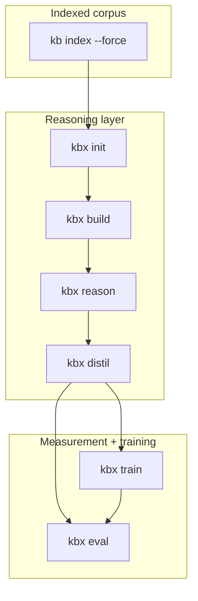

# Eval and training — playbook

Developer guide: build the reasoning layer, synthesize training data, optimize the answer
prompt with GEPA, and evaluate the reader end to end — all with the self-contained **`kbx`**
toolkit. Corpus operators can skip most of this — see [getting-started.md](getting-started.md).

## Why this exists

glossa measures not a bare LLM but an **agent with tools** (`search`, `grep`, `glob`, `read`,
graph, …). The `kbx` toolkit builds a thin query-side reasoning layer over an indexed corpus,
synthesizes grounded `(question, answer)` cases from it, optimizes the answer prompt, and scores
the reader — graph-on vs graph-off, optionally graded by an LLM judge. It needs no external
gateway: everything is driven by a per-workspace `lab.toml` (a model endpoint per role).


```mermaid
flowchart TB
  subgraph corpus [Indexed corpus]
    index[kb index --force]
  end

  subgraph graph [Reasoning layer]
    init[kbx init]
    build[kbx build]
    reason[kbx reason]
    distil[kbx distil]
  end

  subgraph work [Measurement + training]
    eval[kbx eval]
    train[kbx train]
  end

  index --> init
  init --> build
  build --> reason
  reason --> distil
  distil --> eval
  distil --> train
  train --> eval
```

---

## Corpus and reasoning graph

Default work corpus: **`kb-test/`** (git-ignored). The `kbx` pipeline runs over any indexed
corpus. Build or rebuild the search index **before** eval or training (not per question):

```bash
./target/release/kb index kb-test --force    # Windows: kb.exe
```

> **Local prerequisites:** the `kb-val/derived/*.json` case registries and any `eval-corpus/`
> are local, git-ignored data — they do not ship with the repo. Recipes that reference them
> require generating or providing this data locally first.

### The `kbx` pipeline (reasoning-layer toolkit)

The reasoning layer is built and evaluated by the **`kbx`** toolkit — a single self-contained
binary with a verb per lifecycle stage, configured by a per-workspace `lab.toml` (a model endpoint
per role). Over an indexed corpus:

| Verb | Stage |
|---|---|
| `kbx init` | Scaffold a `.glossa/kbx/` workspace (lab.toml, prompts, dataset) |
| `kbx build` | Phase 1 — harvest grounded terminals from each document |
| `kbx reason` | Phase 2 — synthesize the query-side reasoning layer |
| `kbx train` | `(Q,A)` + GEPA optimization of the answer prompt (iteration-based progress bar) |
| `kbx distil` | Densify the graph, emit `(Q,A)` golds, or enrich search aliases (stronger model) |
| `kbx eval` | Score the reader (graph-on vs graph-off), optionally graded by an LLM judge |
| `kbx export` | Build SFT / DPO fine-tuning datasets from captured trajectories |

Endpoints, sampling, retries, and the optional gates are all configured in `lab.toml` — see the
self-documenting [template](../eval/templates/lab.toml). Notable capabilities:

- **Multi-API transport** — each endpoint's `api` selects `openai` (default), `anthropic` (native
  Messages), `openai_responses`, or `tensorzero` (native `/inference` with episode grouping and
  judge feedback for TZ observability).
- **Rate-limit resilience** — opt-in per-endpoint retry/backoff + throttle and an ordered fallback chain.
- **Custom per-endpoint request headers** — an endpoint may carry extra headers, with a
  `${{session}}` placeholder resolved to a per-case/per-worker session id. For gateways that
  require a cache/session header (e.g. OpenCode's `x-opencode-session`); absent by default, so
  other providers are unaffected.
- **Per-endpoint temperature**; **parallel workers** per stage via `[tuning] jobs_*`.
- **GEPA minibatch mode** — `kbx train` defaults to **canonical GEPA**: every proposal samples a
  fresh reflect minibatch and re-scores the parent on it (an unbiased paired accept with the best
  exploration, and no over-fitting to one frozen batch). For a **weak, high-variance reader** (e.g. a
  4B) whose per-proposal noise drowns the accept signal — minibatch of 3, one flip = 0.33, so nothing
  reliably "beats" its parent — set `[tuning] gepa_minibatch_cache = true` to freeze each candidate's
  minibatch and reuse it (a stable but biased baseline). A strong, low-variance reader wants the
  default. `GEPA_MINIBATCH_CACHE=1/0` overrides the file for a one-off sweep. Either way the
  full-set **apply-gate** refuses to write a winner that regresses against the seed prompt.
- **GEPA rollout averaging** — `[tuning] gepa_rollout_samples` (default `1`). `K>1` rolls each
  question `K` times and averages its score, so every downstream decision (accept child-vs-parent,
  the Pareto vectors, the full-set apply-gate) rests on a less noisy estimate — cutting a weak,
  high-variance reader's per-rollout variance at `K×` the model-call cost. `1` = a single rollout
  (today's behavior).
- **user_sim dialogue gate** — an opt-in patient simulated user that deflects a non-answer back into
  the reader loop instead of accepting it (eval + train).
- **Customer-facing prediction runs** — `kbx eval run --no-gold` runs the reader over a question list
  WITHOUT scoring (skips the judge, keeps `answerable=false` cases, tolerates empty gold answers), so
  a fresh unanswered question set can be run as-is. `--answers <path>` writes a flat question→answer
  CSV (UTF-8 BOM so Excel opens Cyrillic, RFC-4180 quoting, a trailing blank `quality` column for the
  reviewer) for handing to a customer to grade. With golds present the CSV also carries `gold` +
  `verdict` columns (validate against gold and export the transcript in one run). A relative
  `--answers` path resolves under `runs/<tag>/` (never the indexed corpus); absolute is used as given.
- **Evidence-grounded judge** — grades an answer against the retrieved source evidence, not only the gold string.
- **Anti-loop retrieval signals** — neutral plateau/repeat/streak markers curb search spirals and feed
  DPO-on-plateau fine-tuning pairs.

For the operator-facing create / maintain workflows, see [graph-lifecycle.md](graph-lifecycle.md);
for building fine-tuning datasets, [finetuning-datasets.md](finetuning-datasets.md).

### Distil — densify, golds, and alias enrichment

`kbx distil` runs a **stronger** model over the built graph in one of three modes:

- **Densify** (default) — reads each grounded section and adds the query-side reasoning the weak
  builder missed, writing through `graph_upsert`.
- **Golds** (`--emit-golds <file.toml>`) — instead of editing the graph, walks grounded seeds and
  emits synthetic `(question, answer)` cases (each proposed via `propose_gold`, self-gated, and
  dropped if it is answerable without the reasoning chain). This is the question source for
  training — see [finetuning-datasets.md](finetuning-datasets.md).
- **Alias enrichment** (`--aliases-only`) — adds the short, real-user search phrasings ("aliases")
  to alias-poor nodes so the reader's glossary / lexical lookup actually finds them. It seeds from
  each grounded terminal, walks that terminal's Chaining component once, and for every
  under-aliased node on the chain adds a handful of alternative wordings — synonyms, the symptom or
  task in plain words, abbreviations, the short name, the same phrasing in the corpus's other
  language — in a single `graph_update`. One shot per chain (capped rounds), so a full pass is
  cheap. `--min-aliases N` sets the poverty threshold (default 3 — nodes with fewer aliases get
  enriched); the prompt is the editable `aliases.md` in the workspace.

  *Why it exists:* a multi-hop question stalls when a query-side node is reachable in the graph but
  shares no words with how a user phrases the question, so the lexical rank can't float it. Alias
  enrichment closes that gap without adding nodes or edges — the graph stays thin.

### Prepare a training dataset (end to end)

The reasoning graph is also the source of fine-tuning data. Over an indexed corpus:

```bash
kbx init                             # scaffold .glossa/kbx/ (once)
kbx build                            # phase 1 — grounded terminals
kbx reason                           # phase 2 — query-side reasoning layer
kb graph doctor && kb graph prune    # clean orphans / stale (see graph-lifecycle.md)
kbx distil                           # densify with a strong model (optional)
kbx distil --aliases-only            # enrich search aliases → better retrieval → better capture
kbx distil --emit-golds qa.toml      # synthesize (Q,A) golds from the graph
kbx eval run --dataset qa.toml --capture --tag teacher   # solve the golds, capture trajectories
kbx export --from teacher --format sft --out teacher-sft.jsonl
```

The first steps prepare the graph and the question set; `eval --capture` + `export` turn the
captured trajectories into Unsloth-ready SFT / DPO JSONL. Format details and the on-policy (DPO)
variant live in [finetuning-datasets.md](finetuning-datasets.md).

### Train — checkpoint / resume and the three-phase bar

`kbx train` is **crash-resumable**. It writes a single, stable, timestamp-free checkpoint —
`gepa.checkpoint.json` under the workspace kbx dir (`<root>/.glossa/kbx/`) — after the
baseline/Pareto pass and after each accepted search iteration, then candidate-by-candidate through
the final-val pass. Interrupt a run and re-launch it and it picks up where it stopped instead of
re-scoring completed work.

A checkpoint carries a **fingerprint** of the run config, so resumption is guarded:

| Flag | Behavior |
|---|---|
| *(none)* | A matching checkpoint resumes automatically; a checkpoint whose fingerprint no longer matches the current config **errors**, telling you to pass `--force` or `--resume`. |
| `--resume` | Resume from the on-disk checkpoint **even if the fingerprint drifted**. Errors if there is nothing on disk to resume. |
| `--force` | Discard any existing checkpoint and start a fresh run (overwrites it as it proceeds). Mutually exclusive with `--resume`. |

The progress bar runs in **three phases**, each with its own elapsed/ETA: **baseline** (score the
seed prompt over the validation split + build the Pareto set), **search** (the reflect→mutate
budget), and **final-val** (re-score every pool candidate to pick the winner). A resumed run skips
whatever the checkpoint already covered. `--no-progress` hides the bar (non-TTY / logging).

### Train knobs — rollout averaging, vision, dedup, cross-model

| Knob | Where | Meaning |
|---|---|---|
| `[tuning] gepa_rollout_samples` | `lab.toml` | `K`-sample rollout averaging (default `1`). `K>1` rolls each question `K` times and averages the score, so every accept / Pareto / apply-gate decision rests on a less noisy estimate — cutting a weak, high-variance reader's per-rollout noise at `K×` the model-call cost. Floored at 1. |
| `--vision` (env `GLOSSA_VISION`) | `kbx train` | Feed the reader `read`-tool images (page rasters / embedded figures) as vision input during GEPA rollouts. **Off by default** (text-only rollouts). |
| `--dedup` (env `GLOSSA_MCP_DEDUP`) | `kbx train` | Gate the reader anti-loop (repeat / streak / **plateau** markers on the retrieval tools) in train rollouts. **Off by default** (`config::defaults::DEDUP`). With dedup off, GEPA and fine-tuning never see the plateau training signal — pass `--dedup` for a run that wants to optimize on it or reproduce a `--dedup` deployment. |
| `--lab <path>` | `kbx train` | Override the `lab.toml` path (default `<root>/.glossa/kbx/lab.toml`). Enables a **cross-model** job: point `train` at e.g. `lab.35b.toml` while a concurrent `kbx eval` uses `lab.9b.toml`. Prompt files still come from the workspace. |

### Vision and dedup in the eval reader

`kbx eval run` carries the same two switches, symmetric to `kbx train` and the MCP server, so an
eval reproduces a given deployment exactly:

- `--vision` (env `GLOSSA_VISION`) — advertise `read(page_image)` and feed returned page images to
  the model. Off by default. Matches an MCP server launched with `--vision`.
- `--dedup` (env `GLOSSA_MCP_DEDUP`) — enable the retrieval anti-loop (repeat / streak / plateau
  markers) in the eval reader. Off by default (`config::defaults::DEDUP`); a bare `--dedup` turns it
  on. Mirrors the MCP server's `--dedup`.

### Judge — dialogue-aware grading and majority voting

The evidence-grounded judge grades an answer against the retrieved source evidence, not only the
gold string, and it is **dialogue-aware**: with a `[user_sim]` endpoint configured in `lab.toml`, a
patient simulated user deflects a bare non-answer back into the reader loop instead of letting a
text-only turn end it (train and eval share the same dynamics).

Judge voting is **intrinsic**: every `judge()` call samples the endpoint several times with the same
message and returns the **majority verdict** (ties break by mode, then severity), taming the model's
run-to-run flip-flopping. The default is **5 samples**; there is no per-call opt-out. Override the
count for a whole run with the `KB_EVAL_JUDGE_VOTES` environment variable.

### Verifier calibration and NLI support-verifier

The answer-grounding gate's verify threshold is calibrated by `kbx eval calibrate`. Alongside the
default sweep over a past run's graded cases, `--from-dataset <path>` builds a **run-free bootstrap
prior** straight from a dataset — it scores the **gold** answers (clean), not the reader's own
outputs, so you can calibrate before you have a single scored run. Positives = answerable golds vs
their `source` (or a retrieved proxy); negatives = unanswerable golds vs the top hit **plus** hard
retrieval distractors. The negative set is **denoised** — it skips the false-negative-prone top hits
and drops any distractor the answer already grounds well — and a **reliability gate** reports the
AUROC separation of positives vs negatives per signal (grounding/AC and NLI); trust the prior only
when that AUROC sits comfortably above chance. A minimum class count is enforced so a tiny pool
errors instead of writing a garbage prior.

Verify mode is selected by `[verify] mode` in the corpus `ontology.toml` (env `GLOSSA_VERIFY_MODE`
overrides; precedence env > ontology > default):

| `mode` | Behavior |
|---|---|
| `ac` | Answer-coverage grounding only. The **default** — a corpus that sets nothing is unchanged. |
| `nli` | NLI support-verifier: per-claim entailment against the retrieved evidence. Needs a wired model dir **and** calibrated thresholds to actually fire, else it fails open to AC. |
| `combined` | Calibrated z-score consensus of AC and NLI. Needs both buckets calibrated, else fails open per-call. |

**Wiring the NLI model** — the `kbx nli` group:

```bash
kbx nli download --to <dir>                      # fetch fp32 from the default repo
kbx nli download --fp16 --to <dir>               # or --int8; saved locally as model.onnx
kbx nli set --model-dir <dir> --scorer in_process [--mode nli] [--device cuda]
kbx nli check [PATH]                              # will the verifier run, or why it fails open to AC?
```

`download` pulls a precision variant from the baked default repo when `--repo` is omitted: no flag ⇒
fp32, `--fp16` / `--int8` (mutually exclusive) fetch the half- or int8-weight variant. The chosen
variant is always written locally as the canonical `model.onnx` (fp32 also brings `model.onnx.data`);
`--repo` / `--file` override for a third-party model. `nli set` writes `[verify.nli]` (`model_dir`,
`scorer`, optional `entail_index`, `device`, and — only if given — `[verify] mode`) into
`ontology.toml`, preserving the rest of the file. `--device` is a single compute device
(`cpu`|`cuda`|`directml`|`rocm`) with automatic CPU fallback. `nli check` reports the compiled engine
and whether every precondition is met.

**Wiring the reranker** — the `kbx rerank` group mirrors `kbx nli` for the cross-encoder reranker:

```bash
kbx rerank download [--fp16|--int8] --to <dir>   # fetch a variant (default repo; fp32 if no flag)
kbx rerank set --model-dir <dir> --scorer in_process [--pool-size N] [--device cuda]
kbx rerank check --model-dir <dir> [--device cuda]
```

`rerank set` writes `[rerank]` (`model_dir`, `scorer`, optional `pool_size` / `device` /
`gpu_id` / `gpu_mem_mb`) into `ontology.toml`, preserving every other table. Unlike `nli
check`, `rerank check` probes the `--model-dir` weights directly — a green check means the model loads
and ranks a relevant passage above an irrelevant one, not that retrieval is wired to use it.

The NLI engine is compiled in at build time — exactly one per binary: the **ORT** engine
(`model.onnx`) or a **pure-Rust burn** engine (`.safetensors`), the latter as `burn-wgpu (vulkan)`
on the GPU or `burn (ndarray/cpu)`. `nli check` prints which engine the binary carries.

### Dataset file operations (`kbx dataset`)

Pure, offline operations over `dataset.toml`-shape files (the `[[case]]` format) — every op reads
through the single case parser, so no field (`hop_type` / `needs_graph` / `source` / `answerable`)
is silently dropped:

| Command | Does |
|---|---|
| `kbx dataset stat <file>` | Read-only counts / breakdowns: `hop_type`, `answerable` vs `unanswerable`, `needs_graph`, alias coverage, duplicate/blank counts, question/answer length min/median/max — plus an **answer-reachability** table when a graph is present. |
| `kbx dataset merge --from <a> --into <b>` | Append `a`'s cases into `b`, deduped by normalized question, re-id-ing colliding ids; backs `b` up to `<b>.bak` first. |
| `kbx dataset validate <file>` | Check non-empty q/a, valid `hop_type`, unique ids; exits non-zero on any issue. |
| `kbx dataset dedup <file>` | Remove normalized-duplicate questions (keep first); backs up to `<file>.bak`. |
| `kbx dataset sample <file> -n N [--seed S]` | Print `N` cases chosen with a seeded (reproducible) RNG; `--seed` default `0`, `N ≥ total` prints all. |

`answerable` / `unanswerable` is the gate marker: an `answerable=false` case is an **abstention
test** (correct = the reader declines / says it is not in the KB), scored as such by `kbx eval run`
when a `[judge]` endpoint is configured.

---

## Related

- [graph-lifecycle.md](graph-lifecycle.md) — create / maintain the reasoning graph
- [finetuning-datasets.md](finetuning-datasets.md) — SFT / DPO dataset formats
- [graph-and-ontology.md](graph-and-ontology.md) — ontology model
- [benchmarks.md](benchmarks.md) — published eval numbers
- [mcp.md](mcp.md) — agent tools
- [ROADMAP.md](ROADMAP.md) — backlog
