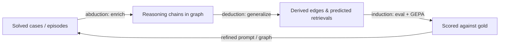

# glossa — graph reasoning directions

Status as of **2026-07-03**. Companion to [ROADMAP.md](ROADMAP.md), focused on **where the reasoning graph is heading** as a matter of inference method, not features.

For what ships today see [architecture.md](architecture.md) (graph layers) and [graph-and-ontology.md](graph-and-ontology.md) (ontology, enrich). For the dev loop see [eval-and-training.md](eval-and-training.md).

Legend: **Shipped** = in a release today; **Partial** = exists but incomplete; **Open** = not built.

---

## Framing: we are already doing Peirce's triad

It is tempting to describe the pipeline as "deduction + induction". It is actually the full **Peircean triad** — the third mode, *abduction*, is already load-bearing and just unnamed:

| Inference mode | What it is | Where glossa does it today | Status |
|----------------|-----------|----------------------------|--------|
| **Abduction** | infer the best explanation for an observation | `enrich` reverse-traces question → answer into a Symptom → Cause → Resolution chain (diagnosis) | **Partial** |
| **Deduction** | derive consequences from rules | `graph generalize` transitive closure over ontology composition rules; `constraint_solve` validate | **Shipped** |
| **Induction** | generalize from accumulated instances | SIMILAR links, community detection, centrality; GEPA over accumulated episodes | **Shipped** |

And the dev loop `enrich → generalize → eval/GEPA` is, structurally, the **hypothetico-deductive method**: abduction proposes a hypothesis, deduction derives testable consequences, induction checks them against data.

Naming this explicitly is itself useful: every proposed direction below is "make one leg of the triad first-class, or add a mode of inference the triad does not yet cover."

---

## What is under-used today

- **Abduction is a side effect of `enrich`, not an inference mode at query time.** At inference the agent just walks `neighbors`; there is no explicit "best explanation" ranking.
- **`confidence` is stored on every node/edge but not used as a probability.** Provenance carries a confidence field; nothing updates it (Bayesian updating) or reasons over it (posterior ranking).
- **SIMILAR is surface-level.** Label Jaccard + shared evidence — lexical overlap, not relational structure.
- **The ontology is monotonic and strict.** No notion of defaults, exceptions, or retraction.
- **The ontology is hand-authored.** `ontology.toml` is written by humans; the graph does not propose its own schema.
- **Conflicting sources are not adjudicated.** The multi-document model (constraint branch) assembles constraints from several standards but has no mechanism for "these two disagree — which wins."

---

## Directions

Each item: the idea, the glossa hook it reuses, why it should be effective, and rough effort (S/M/L).

### 1. Abduction as a first-class query mode — *parsimonious covering*

**Idea.** Formalize diagnosis as set cover (Reggia's parsimonious covering theory): given a set of symptoms, return the **minimal set of causes** that explains all of them, ranked by explanatory power (coverage, parsimony, confidence).

**Hook.** The Symptom → Cause → Resolution spine already exists from `enrich`; this adds a solver over that subgraph, analogous to how `constraint_solve` reads a constraint subgraph.

**Why effective.** Directly serves the support use case: turns "walk related cases" into "here is the smallest explanation that accounts for everything you reported," with alternatives ranked. Also gives eval a crisper target than free-form chains.

**Effort.** M. Reuses graph + a new solve mode / MCP tool. Its probabilistic counterpart — ranking explanations by posterior probability — is [direction 2](#2-bayesian-inference-over-confidence--diagnosis-updating-and-optimization).

### 2. Bayesian inference over `confidence` — *diagnosis, updating, and optimization*

**Idea.** Bayes is the natural probabilistic backbone here, because it is exactly the math of inference to the best explanation: `P(cause | symptoms) ∝ P(symptoms | cause) · P(cause)`. It ties three things together:

- **Bayesian diagnosis.** Rank causes by posterior probability. Priors `P(cause)` come from case frequencies in the graph (this *is* the induction leg); likelihoods `P(symptom | cause)` from how often the two co-occur in solved chains. Naive Bayes over the Symptom → Cause spine works almost immediately; its principled generalization is **noisy-OR / QMR-DT**, a Bayesian network that is the probabilistic form of the set-cover abduction in [direction 1](#1-abduction-as-a-first-class-query-mode--parsimonious-covering). Directions 1 and 2 converge here: hard covering vs. ranked-by-probability covering.
- **`confidence` as a Bayesian quantity.** Treat each node/edge confidence as a subjective probability and update it conjugately — **Beta-Bernoulli**, where an edge's reliability is `Beta(α confirmations, β contradictions)` and every new case shifts the posterior. Cheap, online, and more honest than a static number.
- **Bayesian optimization of the GEPA loop.** Today candidate acceptance is effectively frequentist (minibatch improve → pool, final re-score on full val) and the budget is expensive. Keeping a posterior over each candidate's accuracy and allocating evaluations by uncertainty (**Bayesian optimization / Thompson sampling**) spends the budget where it matters — fewer model calls for the same or better prompt.

For retrieval, note that BM25 already has a probabilistic-relevance heritage (Binary Independence Model); graph retrieval can rank chunks by `P(chunk is gold | query)` with graph evidence as features.

**Hook.** `confidence` is already on every node/edge; case frequencies from the graph supply priors; the eval harness already scores candidates GEPA could allocate by uncertainty.

**Why effective.** Cheapest use of data already present, and it unifies the abduction ranking (direction 1) with the induction priors — one posterior instead of ad-hoc heuristics. Gives a principled ranking signal for `glossary`/`neighbors`, a tie-breaker when multiple chains apply, and a more sample-efficient optimizer.

**Caveats.** Naive Bayes assumes symptoms are conditionally independent given the cause — often false; move to noisy-OR / Bayesian networks when it bites. Thresholds only mean something if the probabilities are **calibrated** (Platt / Beta calibration for judge and `confidence`). Markov Logic Networks remain the heavy, fully general option (logic + probability), but the Bayesian steps above are the lighter, higher-leverage first move.

**Effort.** S→M for Beta-Bernoulli updating and naive-Bayes diagnosis; M for Bayesian optimization of GEPA; L for noisy-OR networks or a full MLN.

### 3. Analogical reasoning by structure, not words — *structure-mapping*

**Idea.** Complement lexical SIMILAR with **relational** similarity (Gentner's structure-mapping): match the *shape* of causal chains, so a solved case transfers to a new one even with no shared vocabulary.

**Hook.** The derived layer already computes SIMILAR; this adds a structural comparator over Cause/Resolution subgraphs.

**Why effective.** Should lift recall on novel questions — exactly what the eval harness measures — because transfer stops depending on surface tokens.

**Effort.** M.

### 4. Defeasible / non-monotonic rules

**Idea.** Let the ontology express "usually X causes Y, unless Z" and retract conclusions when new evidence arrives (default logic / answer-set programming).

**Hook.** `ontology.toml` is the natural place to declare defeasible vs strict relations; the derived layer would honor exceptions.

**Why effective.** Real support/standards knowledge is full of exceptions; a monotonic graph over-commits. High practical payoff for answer correctness.

**Effort.** L — changes the inference semantics, not just data.

### 5. Inductive Logic Programming — *grow the ontology from the graph*

**Idea.** Mine frequent causal/relational patterns in the graph and **propose new relation types and rules** (ILP), instead of hand-writing every ontology relation.

**Hook.** The graph is already a labeled relational dataset with provenance; enrich keeps filling it.

**Why effective.** Closes another self-improvement loop — the graph teaches its own schema — matching the theme that the KB grounds its own optimization. Reduces the hand-authoring bottleneck in `ontology.toml`.

**Effort.** L.

### 6. Argumentation frameworks for conflicting sources

**Idea.** Represent competing resolutions as arguments with an "attacks" relation (Dung's abstract argumentation) and compute which survive; generalize `constraint_solve check` from "is this model consistent" to "given contradictions, what is defensible."

**Hook.** The multi-document source model in the constraint branch already assembles claims from several standards.

**Why effective.** Standards and vendor docs disagree; today there is no principled adjudication. Gives deterministic, explainable conflict resolution.

**Effort.** M→L.

### Further out

- **Modal / temporal logic** — reason about validity across document versions and firmware ranges ("holds for revision ≥ X"). Provenance timestamps and file signatures make this natural.
- **Counterfactual / causal intervention** — "if this parameter were different, would the resolution change?" Extends `constraint_solve infer` toward Pearl-style what-if on the graph.

---

## Priority ordering

By expected payoff over effort, and by how much each reuses what already exists:

1. **Abduction as a mode (1)** and **Bayesian confidence + diagnosis (2)** — reuse the existing spine and the `confidence` field; smallest new surface. Bayesian optimization of GEPA is a cheap, high-leverage side win.
2. **Analogical structure-mapping (3)** — targets the eval metric directly (recall on novel questions).
3. **Defeasible rules (4)** and **ILP ontology growth (5)** — more ambitious, strategically strong; change inference semantics and schema authoring.
4. **Argumentation (6)** — pairs naturally with Track C (standards / constraint validation) once multi-document conflicts are common.

This extends the existing ROADMAP item *Graph → "Induction/deduction ontology" (Open)* into a concrete, method-driven sequence.

---

## Principles (unchanged)

- **Deterministic derived layer stays deterministic.** Probabilistic/defeasible reasoning is additive and explainable, not a black box replacing closure/SIMILAR/communities.
- **Domain rules live in `ontology.toml`,** not hardcoded in Rust — new inference modes are engines over declared rules, kept domain-agnostic.
- **File-first and offline.** No new mode may require a vector DB or a network service for core operation.
- **Everything measurable.** Each mode ships with an eval hook so its effect on retrieval/answer quality is logged, not asserted.

## Related

- [architecture.md](architecture.md) — graph layers (structural / reasoning / derived)
- [graph-and-ontology.md](graph-and-ontology.md) — ontology overlay and enrich
- [eval-and-training.md](eval-and-training.md) — the abduction→deduction→induction dev loop in practice
- [ROADMAP.md](ROADMAP.md) — backlog and product tracks
